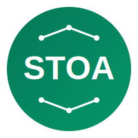

<p align="center">
  
</p>

<h1 align="center">STOA Platform</h1>

<p align="center">
  <strong>MCP Gateway for the AI Era</strong>
</p>

<p align="center">
  <a href="https://github.com/stoa-platform/stoa/actions"></a>
  <a href="https://github.com/stoa-platform/stoa/releases"></a>
  <a href="https://github.com/stoa-platform/stoa/blob/main/LICENSE"></a>
  <a href="https://discord.gg/j8tHSSes"></a>
  <a href="https://docs.gostoa.dev"></a>
</p>

---

## What is STOA?

STOA is an open-source **MCP (Model Context Protocol) Gateway** that enables seamless communication between AI agents and external tools/services. Think of it as an API Gateway, but designed specifically for the AI era.

## Architecture

```
┌─────────────────────────────────────────────────────────────────────────┐
│                              STOA GATEWAY                               │
├─────────────────────────────────────────────────────────────────────────┤
│                                                                         │
│   ┌─────────────┐     ┌─────────────┐     ┌─────────────┐              │
│   │   Claude    │     │   GPT-4     │     │   Gemini    │   AI Agents  │
│   └──────┬──────┘     └──────┬──────┘     └──────┬──────┘              │
│          │                   │                   │                      │
│          └───────────────────┼───────────────────┘                      │
│                              │                                          │
│                              ▼                                          │
│                    ┌─────────────────┐                                  │
│                    │   MCP Router    │                                  │
│                    └────────┬────────┘                                  │
│                             │                                           │
│          ┌──────────────────┼──────────────────┐                        │
│          │                  │                  │                        │
│          ▼                  ▼                  ▼                        │
│   ┌─────────────┐    ┌─────────────┐    ┌─────────────┐                │
│   │    Auth     │    │ Rate Limit  │    │   Logging   │  Middleware   │
│   └─────────────┘    └─────────────┘    └─────────────┘                │
│                             │                                           │
│          ┌──────────────────┼──────────────────┐                        │
│          │                  │                  │                        │
│          ▼                  ▼                  ▼                        │
│   ┌─────────────┐    ┌─────────────┐    ┌─────────────┐                │
│   │  Database   │    │    APIs     │    │   Files     │  MCP Servers  │
│   │   Server    │    │   Server    │    │   Server    │                │
│   └─────────────┘    └─────────────┘    └─────────────┘                │
│                                                                         │
└─────────────────────────────────────────────────────────────────────────┘
```

## Features

- **MCP Native** - Built from the ground up for the Model Context Protocol
- **Multi-Agent Support** - Connect multiple AI agents simultaneously
- **Extensible** - Easy plugin system for custom MCP servers
- **Secure** - Built-in authentication, rate limiting, and audit logging
- **Observable** - OpenTelemetry integration for metrics and tracing

## Quick Start

### Prerequisites

- Go 1.22+
- Docker (optional)

### Installation

```bash
# Clone the repository
git clone https://github.com/stoa-platform/stoa.git
cd stoa

# Build
make build

# Run
./bin/stoa serve
```

### Docker

```bash
docker run -p 8080:8080 ghcr.io/stoa-platform/stoa:latest
```

### Configuration

Create a `stoa.yaml` configuration file:

```yaml
server:
  port: 8080

mcp:
  servers:
    - name: filesystem
      command: npx
      args: ["-y", "@modelcontextprotocol/server-filesystem", "/data"]
    - name: postgres
      command: npx
      args: ["-y", "@modelcontextprotocol/server-postgres"]
      env:
        DATABASE_URL: "${DATABASE_URL}"

auth:
  enabled: true
  providers:
    - type: api_key
```

## Documentation

Full documentation is available at [docs.gostoa.dev](https://docs.gostoa.dev)

- [Getting Started](https://docs.gostoa.dev/getting-started)
- [Configuration](https://docs.gostoa.dev/configuration)
- [MCP Servers](https://docs.gostoa.dev/mcp-servers)
- [API Reference](https://docs.gostoa.dev/api)

## Contributing

We welcome contributions! Please see our [Contributing Guide](CONTRIBUTING.md) for details.

## Community

- [Discord](https://discord.gg/j8tHSSes) - Join our community
- [GitHub Discussions](https://github.com/stoa-platform/stoa/discussions) - Ask questions
- [Twitter](https://twitter.com/stoa_platform) - Follow for updates

## License

STOA is licensed under the [Apache License 2.0](LICENSE).

---

<p align="center">
  Made with ❤️ by the STOA community
</p>
