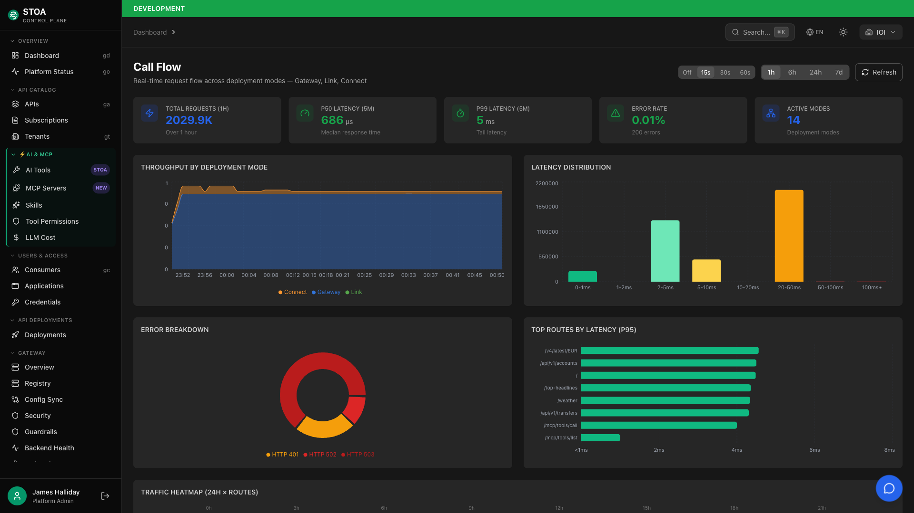
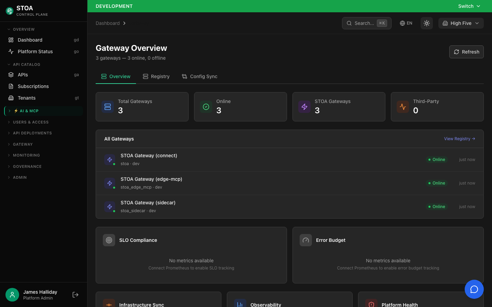

<p align="center">
  <strong>STOA Platform</strong><br>
  The European Agent Gateway<br>
  <em>Bridge enterprise APIs to AI agents. Define once, expose everywhere.</em>
</p>

<p align="center">
  <a href="LICENSE"></a>
  <a href="https://github.com/stoa-platform/stoa/actions/workflows/control-plane-api-ci.yml"></a>
  <a href="https://github.com/stoa-platform/stoa/stargazers"></a>
  <a href="https://discord.gg/j8tHSSes"></a>
</p>
<p align="center">
  <a href="https://gostoa.dev">Website</a> · <a href="https://docs.gostoa.dev">Docs</a> · <a href="https://discord.gg/j8tHSSes">Community</a> · <a href="https://status.gostoa.dev">Status</a>
</p>

---

**STOA** is an open-source API management platform that bridges enterprise APIs to AI agents. Define your API once, expose it everywhere — REST + MCP.

> **Universal API Contract (UAC):** Define Once, Expose Everywhere.

<p align="center">
  
</p>

<details>
<summary>More screenshots</summary>

<p align="center">
  
</p>

</details>

## Why STOA?

| Problem | STOA Solution |
|---------|--------------|
| 5 days to get API access | Self-service portal, instant credentials |
| API catalog in Excel | Searchable catalog with OpenAPI specs |
| Gateway = vendor lock-in | Open-source, full observability, Rust performance |
| AI agents can't use enterprise APIs | MCP bridge: legacy API → AI agent tool |
| Multi-org identity is a nightmare | Keycloak federation across organizations |
| Locked into one gateway vendor | Multi-gateway adapters: Kong, Gravitee, Apigee, Azure APIM, AWS, webMethods |

## Architecture

```
┌──────────────────────────────────────────────────────────────────┐
│                         STOA Platform                            │
│                                                                  │
│  Console ──── Control Plane API ──── Keycloak ──── Portal        │
│  (React 19)    (Python/FastAPI)      (OIDC)      (React 19)     │
│                       │                                          │
│             ┌─────────┴─────────┐                                │
│             │   Rust Gateway    │ ◄── MCP + JWT + mTLS + Quotas  │
│             │  (Tokio + axum)   │                                │
│             └─────────┬─────────┘                                │
│                       │                                          │
│   ┌───────────────────┼───────────────────┐                      │
│   │                   │                   │                      │
│   ▼                   ▼                   ▼                      │
│  Kong            Gravitee            webMethods    ◄── Adapters  │
│  Apigee          Azure APIM         AWS API GW                   │
│                                                                  │
│  Prometheus ── Grafana ── Loki ── OpenSearch                     │
│  (Metrics)   (Dashboards) (Logs) (Error Tracking)                │
└──────────────────────────────────────────────────────────────────┘
```

## Quick Start

```bash
# Clone
git clone https://github.com/stoa-platform/stoa.git
cd stoa/deploy/docker-compose

# Start (21 services, ~3GB RAM)
cp .env.example .env
docker compose up -d

# Wait for healthy
../../scripts/demo/check-health.sh --wait

# Seed demo data
../../scripts/demo/seed-all.sh --skip-traffic
```

Open http://localhost — login as `halliday` / `readyplayerone`.

For component-by-component local development (without Docker), see [DEVELOPMENT.md](DEVELOPMENT.md).

| Service | URL |
|---------|-----|
| Console | http://localhost |
| Portal | http://localhost/portal |
| API Docs | http://localhost/api/docs |
| Grafana | http://localhost/grafana |
| Keycloak | http://localhost/auth |
| Gateway | http://localhost/gateway/health |

## Features

### API Management
- **Self-Service Portal** — developers discover, subscribe, and test APIs without tickets
- **Admin Console** — manage tenants, APIs, consumers, and subscriptions
- **Multi-Tenant** — full isolation between organizations with RBAC
- **Multi-Gateway** — 7 adapter integrations (Kong, Gravitee, Apigee, Azure APIM, AWS, webMethods, STOA native)

### Rust Gateway (93K LOC, 2,300+ tests)
- **Sub-millisecond proxy** — built with Tokio + axum for maximum throughput
- **JWT validation** — Keycloak OIDC integration with JWKS caching
- **Per-consumer rate limiting** — plan-based quotas with 429 responses
- **mTLS support** — RFC 8705 certificate-bound tokens
- **MCP OAuth 2.1** — RFC 9728 discovery, PKCE, dynamic client registration
- **4-mode architecture** — edge-mcp (active), sidecar, proxy, shadow

### MCP Bridge (AI-Native)
- **Universal API Contract** — define an API once, expose it as REST + MCP tool
- **Tool discovery** — AI agents discover available tools via MCP protocol
- **SSE transport** — real-time streaming for agent communication
- **Governance** — authentication, rate limiting, and audit trail for AI calls
- **5 CRDs** — Tools, ToolSets, Skills, Gateways, GatewayBindings (Kubernetes-native)

### Observability
- **Grafana dashboards** — gateway metrics, tenant analytics, error tracking, arena benchmarks
- **OpenSearch integration** — error snapshots with trace ID correlation
- **Loki log aggregation** — centralized logs from all components
- **Prometheus metrics** — p50/p90/p99 latency, request rates, error rates

### Identity Federation
- **Multi-org Keycloak 26** — federate Active Directory, LDAP, SAML, OIDC
- **Cross-realm token isolation** — zero-trust between organizations
- **Self-registration** — developers onboard without admin intervention
- **FAPI 2.0 architecture** — financial-grade API security (ADR-056)

## Components

| Component | Tech | Purpose |
|-----------|------|---------|
| Control Plane API | Python 3.11, FastAPI, SQLAlchemy 2.0 | Backend API with RBAC, multi-gateway adapters |
| Console UI | React 19, TypeScript, Vite, TanStack Query | Admin interface |
| Developer Portal | React 19, TypeScript, Vite, TanStack Query | Developer self-service |
| Rust Gateway | Rust (stable), Tokio, axum 0.7 | API proxy + MCP bridge (93K LOC) |
| stoactl | Go 1.25, Cobra | GitOps CLI + VPS connect agent |
| Keycloak | Keycloak 26.5 | Authentication + federation |
| K8s Operator | Python, Kopf | CRD controller for MCP resources |
| Helm Chart | Helm 3 (5 CRDs, 33 templates) | Kubernetes deployment |

## Test Suite

| Component | Framework | Tests | Coverage |
|-----------|-----------|-------|----------|
| Control Plane API | pytest + pytest-asyncio | 7,100+ | 70% min |
| Rust Gateway | cargo test | 2,300+ | Unit + contract + integration + security |
| Console UI | vitest + React Testing Library | Per-component | Persona-based (4 RBAC roles) |
| Portal | vitest + React Testing Library | Per-component | Persona-based (4 RBAC roles) |
| E2E | Playwright + BDD (Gherkin) | 77 feature files | @smoke, @critical, @portal, @console, @gateway |

## Deployment

### Docker Compose (Development)

See [deploy/docker-compose/README.md](deploy/docker-compose/README.md) for the full quick-start guide.

### Kubernetes (Production)

```bash
helm install stoa-platform ./charts/stoa-platform \
  -n stoa-system --create-namespace \
  -f charts/stoa-platform/values.yaml
```

Production runs on ArgoCD with GitOps. See [deployment docs](https://docs.gostoa.dev/docs/deployment/hybrid).

## Repository Structure

```
stoa/
├── control-plane-api/     # FastAPI backend (Python 3.11)
├── control-plane-ui/      # React 19 admin console
├── portal/                # React 19 developer portal
├── stoa-gateway/          # Rust API gateway + MCP bridge
├── stoa-go/               # Go CLI (stoactl) + connect agent
├── stoa-operator/         # Kubernetes operator (Python/Kopf)
├── charts/                # Helm chart (5 CRDs, 33 templates)
├── deploy/docker-compose/ # Quick-start setup
├── e2e/                   # Playwright BDD tests
├── scripts/               # Demo, seed, benchmarks
└── docs/                  # Runbooks + methodology
```

## Related Repositories

| Repository | Purpose |
|------------|---------|
| [stoa-docs](https://github.com/stoa-platform/stoa-docs) | Documentation site ([docs.gostoa.dev](https://docs.gostoa.dev)) — 57+ ADRs, guides, API ref |
| [stoa-web](https://github.com/stoa-platform/stoa-web) | Landing page ([gostoa.dev](https://gostoa.dev)) |
| [stoa-quickstart](https://github.com/stoa-platform/stoa-quickstart) | Self-hosted quickstart (Docker Compose) |
| [stoactl](https://github.com/stoa-platform/stoactl) | CLI tool (Go) — kubectl-style API management |

## Benchmark

STOA includes **Gateway Arena**, an open benchmark suite comparing API gateways on proxy throughput and AI-native capabilities (MCP, guardrails, governance). See [methodology](docs/BENCHMARK-METHODOLOGY.md) and [latest results](docs/BENCHMARK-RESULTS.md).

## Documentation

- **Docs**: [docs.gostoa.dev](https://docs.gostoa.dev) — 100+ pages
- **Architecture Decisions**: [57+ ADRs](https://docs.gostoa.dev/docs/architecture/adr/)
- **API Reference**: [Control Plane API](https://docs.gostoa.dev/docs/api/control-plane)
- **Guides**: [Quick Start](https://docs.gostoa.dev/docs/guides/quickstart) · [Migration guides](https://docs.gostoa.dev/docs/guides/migration/) (Kong, Apigee, webMethods)

## Security

STOA runs SAST, dependency scanning, container scanning, and SBOM generation on every PR. 4 checks are required for merge: License Compliance, SBOM Generation, Signed Commits, and Regression Test Guard. See [`SECURITY.md`](SECURITY.md) for details.

## Contributing

We welcome contributions! See [CONTRIBUTING.md](CONTRIBUTING.md) for guidelines.

- **Commits**: `type(scope): description` (commitlint enforced)
- **PRs**: Squash merge to main, < 300 LOC per PR
- **License**: Apache 2.0 with [DCO sign-off](CLA.md)

<a href="https://github.com/stoa-platform/stoa/graphs/contributors">
  
</a>

## Community & Support

- [GitHub Discussions](https://github.com/stoa-platform/stoa/discussions) — questions, ideas, show & tell
- [Discord](https://discord.gg/j8tHSSes) — real-time chat
- [Documentation](https://docs.gostoa.dev) — guides, ADRs, API reference
- [Status Page](https://status.gostoa.dev) — platform uptime monitoring
- [Support](SUPPORT.md) — how to get help and report issues

## License

[Apache License 2.0](LICENSE)

---

<p align="center">
  <em>Built by <a href="https://cabingenierie.com">CAB Ingenierie</a> — Paris, France</em>
</p>
