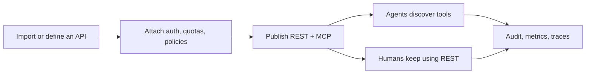

<p align="center">
  <strong>STOA</strong><br>
  <span>The open-source Agent Gateway for governed AI-to-API traffic</span><br>
  <em>Keep your gateway. Add MCP. Govern every agent call.</em>
</p>

<p align="center">
  <a href="LICENSE"></a>
  <a href="https://github.com/stoa-platform/stoa/actions/workflows/control-plane-api-ci.yml"></a>
  <a href="https://github.com/stoa-platform/stoa/stargazers"></a>
  <a href="https://discord.gg/j8tHSSes"></a>
</p>

<p align="center">
  <a href="https://gostoa.dev">Website</a> ·
  <a href="https://docs.gostoa.dev">Docs</a> ·
  <a href="https://github.com/stoa-platform/stoa/discussions">Discussions</a> ·
  <a href="https://discord.gg/j8tHSSes">Discord</a> ·
  <a href="https://status.gostoa.dev">Status</a>
</p>

---

## APIs are becoming AI tools. Who governs the calls?

AI agents are starting to call internal systems: billing, CRM, identity, logistics, support, legacy SOAP services, and private REST APIs.

The hard part is not only making an API callable by an agent. The hard part is answering:

> Which agent called which API, under which identity, through which policy, with which quota, and with what audit trail?

**STOA** is an open-source **Agent Gateway** that sits next to your existing API gateway and exposes enterprise APIs as governed **Model Context Protocol (MCP)** tools.

No gateway replacement. No duplicated API catalog. No untracked agent traffic.

<p align="center">
  
</p>

---

## What you can do with STOA

| In your platform today | With STOA |
| --- | --- |
| APIs live behind Kong, Gravitee, Apigee, Azure APIM, AWS API Gateway, or webMethods | Keep them where they are and add an MCP layer for agents |
| Developers wait for access, credentials, and onboarding | Use a self-service portal for discovery, subscription, and testing |
| API catalogs drift between specs, spreadsheets, and gateways | Define APIs once and expose them as REST endpoints and MCP tools |
| AI agents call tools without enterprise-grade controls | Apply OAuth, mTLS, rate limits, RBAC, quotas, and audit trails |
| Teams lack visibility into AI-to-API traffic | Observe calls with Prometheus, Grafana, Loki, and OpenSearch |

---

## Quick start

Run the full local stack with Docker Compose.

```bash
# Clone
git clone https://github.com/stoa-platform/stoa.git
cd stoa/deploy/docker-compose

# Start the demo stack
cp .env.example .env
docker compose up -d

# Wait for services to become healthy
../../scripts/demo/check-health.sh --wait

# Seed demo data
../../scripts/demo/seed-all.sh --skip-traffic
```

Open `http://localhost` and log in with:

```text
username: halliday
password: readyplayerone
```

| Service | URL |
| --- | --- |
| Console | `http://localhost` |
| Developer Portal | `http://localhost/portal` |
| API Docs | `http://localhost/api/docs` |
| Grafana | `http://localhost/grafana` |
| Keycloak | `http://localhost/auth` |
| Gateway health | `http://localhost/gateway/health` |

For local component-by-component development, see [`DEVELOPMENT.md`](DEVELOPMENT.md).

---

## From API to agent tool in 3 steps


```mermaid
graph LR
  A[Import or define an API] --> B[Attach auth, quotas, policies]
  B --> C[Publish REST + MCP]
  C --> D[Agents discover tools]
  C --> E[Humans keep using REST]
  D --> F[Audit, metrics, traces]
  E --> F
```

1. **Define once** — import OpenAPI or describe the API through STOA's Universal API Contract.
2. **Govern once** — attach identity, plans, rate limits, scopes, and tenant policies.
3. **Expose everywhere** — publish for human developers through REST and for AI agents through MCP.

---

## Why teams choose STOA

### MCP-native, not MCP as an afterthought

STOA is built for AI agents that need to discover and call enterprise APIs safely. Agents connect through MCP; platform teams keep control over identity, authorization, rate limiting, and audit.

### Sidecar by design

STOA does not force a big-bang gateway migration. Existing REST traffic continues through your current gateway while STOA adds a governed MCP path for agents.

### Open source and self-hostable

The core platform is Apache 2.0. Run it locally, in Kubernetes, on-premise, or in a hybrid setup. Fork it, inspect it, extend it, or contribute back.

### Built for European and regulated environments

STOA is designed for teams that care about sovereignty, auditability, data residency, and operational control. It supports self-hosted deployments and keeps governance close to your infrastructure.

---

## Architecture

```text
                         STOA Control Plane
        ┌──────────────────────────────────────────────────┐
        │ Console · Portal · Control Plane API · Keycloak  │
        │ Observability · Tenants · Subscriptions · Audit  │
        └───────────────────────┬──────────────────────────┘
                                │ sync
             ┌──────────────────┴──────────────────┐
             │                                     │
             ▼                                     ▼
┌──────────────────────────┐        ┌─────────────────────────────┐
│ STOA Agent Gateway       │        │ Existing API Gateway         │
│ Rust · MCP · REST bridge │        │ Kong · Gravitee · Apigee     │
│ OAuth · mTLS · quotas    │        │ Azure APIM · AWS · webMethods│
│ Tool discovery · audit   │        │ Existing REST clients stay   │
└─────────────┬────────────┘        └──────────────┬──────────────┘
              │                                    │
              ▼                                    ▼
       AI agents via MCP                    Existing backends
```

**Core idea:** STOA adds a governed agent layer without taking ownership of your whole API estate.

---

## Platform capabilities

| Capability | What it gives you |
| --- | --- |
| **MCP Gateway** | Governed tool discovery and execution for AI agents |
| **Universal API Contract** | One definition for REST and MCP exposure |
| **Self-Service Portal** | API discovery, subscriptions, credentials, and testing |
| **Admin Console** | Tenants, consumers, APIs, plans, subscriptions, and policies |
| **Multi-Gateway Adapters** | Sync with Kong, Gravitee, Apigee, Azure APIM, AWS API Gateway, webMethods, and STOA native |
| **Identity Federation** | Keycloak-based OIDC, SAML, LDAP, Active Directory, and cross-realm isolation |
| **Security Controls** | OAuth 2.1, PKCE, mTLS, JWT validation, RBAC, quotas, and per-consumer rate limiting |
| **Observability** | Prometheus metrics, Grafana dashboards, Loki logs, OpenSearch error snapshots, traces, and audit history |
| **Kubernetes Native** | Helm deployment, operator support, and CRDs for tools, toolsets, skills, gateways, and bindings |

---

## Demo scenarios

After seeding the demo stack, try these flows:

| Scenario | What to look for |
| --- | --- |
| **Developer discovers an API** | Open the Portal, browse the API catalog, inspect specs, and request access |
| **Admin approves and governs access** | Use the Console to manage consumers, plans, subscriptions, tenants, and quotas |
| **Agent calls an API as a tool** | Observe how MCP traffic is authenticated, rate-limited, traced, and audited |
| **Platform team monitors usage** | Open Grafana and inspect latency, request rate, errors, quotas, and gateway health |

<details>
<summary>More screenshots</summary>

<p align="center">
  
</p>

</details>

---

## Who is STOA for?

**Platform teams** who already run API gateways and want an AI agent layer without replacing their infrastructure.

**Integration teams** modernizing legacy REST, SOAP, and webMethods APIs for agentic workflows.

**AI teams** that need real enterprise tools, not toy demos, with authentication, quotas, and audit from day one.

**Open-source builders** who believe the agentic web needs inspectable, self-hostable, standards-based infrastructure.

---

## Under the hood

| Component | Stack | Purpose |
| --- | --- | --- |
| Control Plane API | Python, FastAPI, SQLAlchemy | Backend API, RBAC, adapters, tenants, subscriptions |
| Console UI | React, TypeScript, Vite | Admin experience for platform teams |
| Developer Portal | React, TypeScript, Vite | Self-service API discovery and onboarding |
| STOA Gateway | Rust, Tokio, axum | API proxy, MCP bridge, auth, quotas, audit |
| `stoactl` | Go, Cobra | CLI and GitOps-style operations |
| Keycloak | OIDC, SAML, LDAP | Identity, federation, realms, authentication |
| Kubernetes Operator | Python, Kopf | CRD controller for MCP resources |
| Helm Chart | Helm 3 | Kubernetes installation and production deployment |

---

## Quality and security

STOA is built as infrastructure, not a demo script.

| Area | Practice |
| --- | --- |
| Gateway tests | Unit, contract, integration, and security tests |
| Control plane tests | Async API tests with coverage threshold |
| E2E tests | Playwright + BDD feature files for smoke, critical, portal, console, and gateway flows |
| Supply chain | SAST, dependency scanning, container scanning, SBOM generation, signed commits, and regression guards |

See [`SECURITY.md`](SECURITY.md), [`CONTRIBUTING.md`](CONTRIBUTING.md), and [`docs/`](docs/) for details.

---

## Deploying STOA

### Docker Compose

Use Docker Compose for local demos, development, and evaluation.

```bash
cd deploy/docker-compose
cp .env.example .env
docker compose up -d
```

See [`deploy/docker-compose/README.md`](deploy/docker-compose/README.md).

### Kubernetes

Use Helm for Kubernetes deployments.

```bash
helm install stoa-platform ./charts/stoa-platform \
  -n stoa-system --create-namespace \
  -f charts/stoa-platform/values.yaml
```

See the deployment documentation for production and hybrid environments.

---

## Repository map

```text
stoa/
├── control-plane-api/       # FastAPI backend
├── control-plane-ui/        # React admin console
├── portal/                  # React developer portal
├── stoa-gateway/            # Rust gateway + MCP bridge
├── stoa-go/                 # Go CLI and connect agent
├── stoa-operator/           # Kubernetes operator
├── charts/                  # Helm chart and CRDs
├── deploy/docker-compose/   # Local quick start
├── e2e/                     # Playwright BDD tests
├── scripts/                 # Demo, seed, benchmarks
└── docs/                    # Runbooks, ADRs, methodology
```

---

## Contributing

STOA is early, open, and looking for builders who care about making AI-to-API traffic safe, observable, and self-hostable.

Great places to contribute:

- **Gateway adapters** — Kong, Gravitee, Apigee, Azure APIM, AWS API Gateway, webMethods, and more.
- **MCP examples** — agent clients, tool definitions, demo workflows, Claude/Cursor integrations.
- **Security hardening** — OAuth, mTLS, RBAC, policy evaluation, audit, threat modeling.
- **Observability** — dashboards, traces, error snapshots, benchmark scenarios.
- **Docs and tutorials** — quick starts, migration guides, architecture notes, real-world examples.
- **Developer experience** — `stoactl`, local setup, test ergonomics, CI, Helm values.

Start with [`CONTRIBUTING.md`](CONTRIBUTING.md), open an issue, or join the community on Discord.

<a href="https://github.com/stoa-platform/stoa/graphs/contributors">
  
</a>

---

## Documentation and community

| Resource | Link |
| --- | --- |
| Documentation | <https://docs.gostoa.dev> |
| Website | <https://gostoa.dev> |
| GitHub Discussions | <https://github.com/stoa-platform/stoa/discussions> |
| Discord | <https://discord.gg/j8tHSSes> |
| Status | <https://status.gostoa.dev> |
| Support | [`SUPPORT.md`](SUPPORT.md) |
| Roadmap | [`ROADMAP.md`](ROADMAP.md) |

---

## Related repositories

| Repository | Purpose |
| --- | --- |
| [`stoa-docs`](https://github.com/stoa-platform/stoa-docs) | Documentation site, ADRs, guides, API reference |
| [`stoa-web`](https://github.com/stoa-platform/stoa-web) | Public website |
| [`stoa-quickstart`](https://github.com/stoa-platform/stoa-quickstart) | Self-hosted quick start |
| [`stoactl`](https://github.com/stoa-platform/stoactl) | CLI for API management workflows |

---

## License

STOA is released under the [Apache License 2.0](LICENSE).

<p align="center">
  <em>Built by <a href="https://cabingenierie.com">CAB Ingénierie</a> — Paris, France.</em>
</p>
