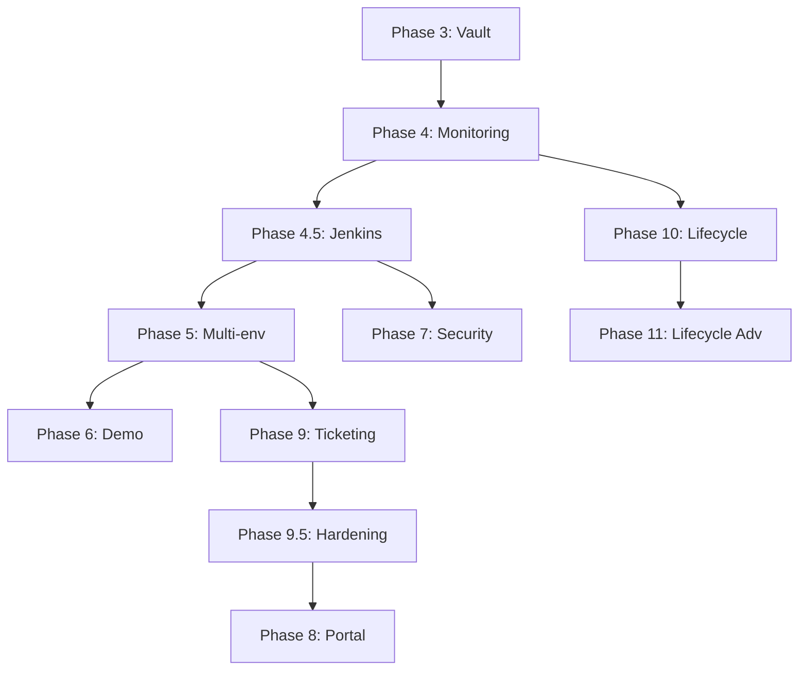

# Linear Import - APIM Platform v2

> **Généré le:** 2025-12-24
> **Source:** Linear (hlfh-workspace)
> **Projet:** APIM Platform v2

---

## 🔗 Extension Linear VSCode

Pour une intégration avec Linear directement depuis VSCode :

### Installation
```bash
# Extension recommandée : Linear by Strigo
code --install-extension strigo.linear
```

Ou rechercher "Linear" dans VSCode Extensions (Ctrl+Shift+X) → installer **Linear by Strigo**.

### Configuration
1. Aller sur [Linear API Settings](https://linear.app/hlfh-workspace/settings/api)
2. Créer une **Personal API Key**
3. Dans VSCode : `Cmd+Shift+P` → "Linear: Set API Key"
4. Coller la clé

### Commandes disponibles
- `Linear: Create Issue` - Créer une issue depuis VSCode
- `Linear: Open Issue` - Ouvrir une issue dans Linear
- `Linear: Search Issues` - Rechercher des issues

### Lien projet
- **Workspace:** hlfh-workspace
- **Projet:** [APIM Platform v2](https://linear.app/hlfh-workspace/project/apim-platform-v2)

---

## 📊 Vue d'ensemble

| Métrique | Valeur |
|----------|--------|
| Total Issues | 77 |
| Phases | 11 (Phase 3 → Phase 11) |
| Estimation totale | ~16-18 semaines |

---

## Configuration Linear

### Labels à créer

#### Par Phase
- `phase:3` - Vault + Alias
- `phase:4` - OpenSearch + Monitoring
- `phase:4.5` - Jenkins Orchestration
- `phase:5` - Multi-environnement
- `phase:6` - Demo Tenant
- `phase:7` - Security Jobs
- `phase:8` - Portal Self-Service
- `phase:9` - Ticketing ITSM
- `phase:9.5` - Production Readiness
- `phase:10` - Resource Lifecycle
- `phase:11` - Resource Lifecycle Advanced

#### Par Type
- `type:feature` - Nouvelle fonctionnalité
- `type:integration` - Intégration système
- `type:security` - Sécurité
- `type:infra` - Infrastructure
- `type:ui` - Interface utilisateur
- `type:api` - Backend API
- `type:docs` - Documentation
- `type:playbook` - Ansible Playbook
- `type:test` - Tests
- `type:epic` - Epic

#### Par Composant
- `component:awx` - AWX/Ansible
- `component:vault` - HashiCorp Vault
- `component:kafka` - Kafka/Redpanda
- `component:keycloak` - Keycloak SSO
- `component:gateway` - Kong Gateway
- `component:gitlab` - GitLab
- `component:cp-ui` - Control Plane UI
- `component:cp-api` - Control Plane API
- `component:jenkins` - Jenkins Orchestration
- `component:terraform` - Infrastructure as Code
- `component:lambda` - AWS Lambda
- `component:n8n` - n8n Workflows
- `component:gatekeeper` - OPA Gatekeeper
- `component:opensearch` - OpenSearch
- `component:prometheus` - Prometheus
- `component:grafana` - Grafana

#### Par Priorité
- `prio:p0` - Critique (bloquant)
- `prio:p1` - Haute
- `prio:p2` - Moyenne
- `prio:p3` - Basse

---

## Milestones

| Milestone | Description | Phases |
|-----------|-------------|--------|
| **M1: Production-Ready** | Plateforme prête pour production | 3, 4, 4.5, 9, 9.5 |
| **M2: Self-Service** | Portail développeur autonome | 5, 6, 8 |
| **M3: Full Automation** | Automatisation complète | 7 |
| **M4: Cost Optimization** | Optimisation coûts et ressources | 10, 11 |

---

## 📅 Planning par Phase

| Phase | Nom | Issues | Priorité | Durée estimée |
|-------|-----|--------|----------|---------------|
| 3 | Vault + Alias | 1 | P0 | 1 semaine |
| 4 | OpenSearch + Monitoring | 5 | P1 | 1.5 semaines |
| 4.5 | Jenkins Orchestration | 11 | P0 | 2 semaines |
| 5 | Multi-environnement | 4 | P1 | 1 semaine |
| 6 | Demo Tenant | 2 | P2 | 0.5 semaine |
| 7 | Security Jobs | 2 | P2 | 1 semaine |
| 8 | Portal Self-Service | 2 | P1 | 2 semaines |
| 9 | Ticketing ITSM | 9 | P0 | 2 semaines |
| 9.5 | Production Readiness | 8 | P0 | 2 semaines |
| 10 | Resource Lifecycle | 11 | P1 | 2 semaines |
| 11 | Resource Lifecycle Advanced | 10 | P2 | 2 semaines |

---

## Statut Actuel du Projet

### Phases Complétées ✅

| Phase | Nom | Status |
|-------|-----|--------|
| Phase 1 | Infrastructure Foundation | ✅ Completed |
| Phase 2 | Event-Driven Core | ✅ Completed |
| Phase 2.5 | OpenAPI Compatibility | ✅ Completed |

### Phases À Faire 📋

| Phase | Nom | Priorité | Estimation |
|-------|-----|----------|------------|
| Phase 3 | Vault + Alias | P0 | 1 semaine |
| Phase 4 | OpenSearch + Monitoring | P1 | 1.5 semaines |
| Phase 4.5 | Jenkins Orchestration | P0 | 2 semaines |
| Phase 5 | Multi-environnement | P1 | 1 semaine |
| Phase 6 | Demo Tenant | P2 | 0.5 semaine |
| Phase 7 | Security Jobs | P2 | 1 semaine |
| Phase 8 | Portal Self-Service | P1 | 2 semaines |
| Phase 9 | Ticketing ITSM | P0 | 2 semaines |
| Phase 9.5 | Production Readiness | P0 | 2 semaines |
| Phase 10 | Resource Lifecycle | P1 | 2 semaines |
| Phase 11 | Resource Lifecycle Advanced | P2 | 2 semaines |

---

## 📋 Issues par Phase

---

### Phase 3: Vault + Alias - Finalisation

**Epic:** [CAB-6](https://linear.app/hlfh-workspace/issue/CAB-6)

#### Objectif
Finalisation de l'intégration Vault pour la gestion des secrets et aliases.

#### Definition of Done
- [ ] Secrets gérés via Vault
- [ ] Rotation automatique des credentials
- [ ] Alias configurés et fonctionnels
- [ ] Audit des accès aux secrets

---

### Phase 4: OpenSearch + Monitoring

**Epic:** [CAB-2](https://linear.app/hlfh-workspace/issue/CAB-2)

#### Objectif
Mettre en place la centralisation des logs et le monitoring avec alerting.

#### Definition of Done
- [ ] Logs visibles dans OpenSearch
- [ ] Alertes Slack fonctionnelles

#### Issues

| ID | Titre | Priorité | Composant |
|----|-------|----------|-----------|
| [CAB-9](https://linear.app/hlfh-workspace/issue/CAB-9) | APIM-401: Déployer Amazon OpenSearch sur EKS | P0 | opensearch |
| [CAB-10](https://linear.app/hlfh-workspace/issue/CAB-10) | APIM-402: Configurer FluentBit pour log shipping | P0 | opensearch |
| [CAB-11](https://linear.app/hlfh-workspace/issue/CAB-11) | APIM-403: Déployer Prometheus + Grafana | P0 | prometheus |
| [CAB-12](https://linear.app/hlfh-workspace/issue/CAB-12) | APIM-404: Créer dashboards OpenSearch | P1 | opensearch |

---

### Phase 4.5: Jenkins Orchestration Layer

**Epic:** [CAB-92](https://linear.app/hlfh-workspace/issue/CAB-92)

#### Objectif
Couche d'orchestration Jenkins entre le Control Plane et AWX pour gérer les pipelines de déploiement avec approval gates.

#### Architecture
```
Control Plane API
       │
       ▼
   Kafka Topic
  (deploy-requests)
       │
       ▼
┌──────────────────┐
│ Jenkins Consumer │ (Python service)
└────────┬─────────┘
         │
         ▼
┌──────────────────┐
│ Jenkins Pipeline │
│  - Validate      │
│  - Approval Gate │ ◄── Production only
│  - AWX Trigger   │
│  - Notify        │
└────────┬─────────┘
         │
         ▼
┌──────────────────┐
│      AWX         │
│  (Playbooks)     │
└────────┬─────────┘
         │
         ▼
   Kong Gateway
```

#### Issues

| ID | Titre | Priorité | Estimation |
|----|-------|----------|------------|
| [CAB-93](https://linear.app/hlfh-workspace/issue/CAB-93) | Déploiement Jenkins sur EKS avec JCasC | P0 | 2j |
| [CAB-94](https://linear.app/hlfh-workspace/issue/CAB-94) | Intégration Keycloak OIDC pour SSO | P0 | 1j |
| [CAB-95](https://linear.app/hlfh-workspace/issue/CAB-95) | Service Kafka Consumer → Jenkins Job Trigger | P0 | 3j |
| [CAB-96](https://linear.app/hlfh-workspace/issue/CAB-96) | Pipeline Deploy API avec Approval Gates | P0 | 2j |
| [CAB-97](https://linear.app/hlfh-workspace/issue/CAB-97) | Pipeline Rollback API | P1 | 1j |
| [CAB-98](https://linear.app/hlfh-workspace/issue/CAB-98) | Shared Library fonctions réutilisables | P1 | 2j |
| [CAB-99](https://linear.app/hlfh-workspace/issue/CAB-99) | Intégration AWX Job Trigger | P0 | 2j |
| [CAB-100](https://linear.app/hlfh-workspace/issue/CAB-100) | Métriques Prometheus et Dashboard Grafana | P2 | 1j |
| [CAB-101](https://linear.app/hlfh-workspace/issue/CAB-101) | Pipeline Sync Gateway Configuration | P2 | 1j |
| [CAB-102](https://linear.app/hlfh-workspace/issue/CAB-102) | Blue Ocean UI et organisation jobs | P3 | 0.5j |

---

### Phase 5: Multi-environnement

**Epic:** [CAB-3](https://linear.app/hlfh-workspace/issue/CAB-3)

#### Objectif
Permettre la promotion des déploiements entre environnements via pipeline automatisé.

#### Definition of Done
- [ ] Promotion DEV → STAGING → PROD via pipeline

#### Issues

| ID | Titre | Priorité |
|----|-------|----------|
| [CAB-13](https://linear.app/hlfh-workspace/issue/CAB-13) | APIM-501: Créer environnement STAGING | P0 |
| [CAB-14](https://linear.app/hlfh-workspace/issue/CAB-14) | APIM-502: Playbook promote-environment.yaml | P0 |
| [CAB-15](https://linear.app/hlfh-workspace/issue/CAB-15) | APIM-503: AWX Job Template Promote API | P0 |

---

### Phase 6: Demo Tenant

**Epic:** [CAB-7](https://linear.app/hlfh-workspace/issue/CAB-7)

#### Objectif
Tenant de démonstration pour les tests et présentations.

#### Issues

| ID | Titre | Priorité |
|----|-------|----------|
| [CAB-24](https://linear.app/hlfh-workspace/issue/CAB-24) | APIM-601: Créer tenant demo avec users beta | P2 |

---

### Phase 7: Security Jobs

**Epic:** [CAB-8](https://linear.app/hlfh-workspace/issue/CAB-8)

#### Objectif
Jobs de sécurité automatisés pour le hardening de la plateforme.

#### Issues

| ID | Titre | Priorité |
|----|-------|----------|
| [CAB-25](https://linear.app/hlfh-workspace/issue/CAB-25) | APIM-701: Image Docker apim-security-jobs | P1 |

---

### Phase 8: Portal Self-Service

**Epic:** [CAB-5](https://linear.app/hlfh-workspace/issue/CAB-5)

#### Objectif
Portail self-service permettant aux développeurs de souscrire aux APIs de manière autonome.

#### Definition of Done
- [ ] 1 développeur externe peut souscrire en self-service

#### Issues

| ID | Titre | Priorité |
|----|-------|----------|
| [CAB-26](https://linear.app/hlfh-workspace/issue/CAB-26) | APIM-801: Setup projet Developer Portal | P2 |

---

### Phase 9: Ticketing ITSM - CRITIQUE PROD

**Epic:** [CAB-4](https://linear.app/hlfh-workspace/issue/CAB-4)

#### ⚠️ CRITIQUE POUR PROD
Intégration ITSM pour validation des déploiements production.

#### Definition of Done
- [ ] **0 déploiement PROD sans ticket approuvé**

#### Issues Backend

| ID | Titre | Priorité |
|----|-------|----------|
| [CAB-16](https://linear.app/hlfh-workspace/issue/CAB-16) | APIM-901: Modèle PromotionRequest + Service Git | P0 |
| [CAB-17](https://linear.app/hlfh-workspace/issue/CAB-17) | APIM-902: Endpoints API /v1/requests/prod | P0 |
| [CAB-18](https://linear.app/hlfh-workspace/issue/CAB-18) | APIM-903: Workflow Approve/Reject anti-self-approval | P0 |
| [CAB-19](https://linear.app/hlfh-workspace/issue/CAB-19) | APIM-904: Webhook callback AWX pour ticketing | P0 |

#### Issues Frontend

| ID | Titre | Priorité |
|----|-------|----------|
| [CAB-20](https://linear.app/hlfh-workspace/issue/CAB-20) | APIM-905: UI - Page liste demandes | P0 |
| [CAB-21](https://linear.app/hlfh-workspace/issue/CAB-21) | APIM-906: UI - Formulaire nouvelle demande | P0 |
| [CAB-22](https://linear.app/hlfh-workspace/issue/CAB-22) | APIM-907: UI - Page détail + Approve/Reject | P0 |
| [CAB-23](https://linear.app/hlfh-workspace/issue/CAB-23) | APIM-908: Events Kafka + Notifications | P1 |

---

### Phase 9.5: Production Readiness (NOUVEAU)

**Epic:** [CAB-103](https://linear.app/hlfh-workspace/issue/CAB-103)

#### Objectif
Préparer la plateforme APIM pour le passage en production avec toutes les garanties de fiabilité, sécurité et opérabilité.

#### Definition of Done
- [ ] Backup/Restore AWX testé
- [ ] Backup/Restore Vault testé
- [ ] Load Test Pipeline opérationnel
- [ ] Runbooks documentés
- [ ] Security Scan OWASP passé
- [ ] Chaos Testing validé
- [ ] SLO/SLA documentés

#### Issues

| ID | Titre | Priorité | Estimation |
|----|-------|----------|------------|
| [CAB-104](https://linear.app/hlfh-workspace/issue/CAB-104) | APIM-9501: Backup/Restore AWX | P0 | 2j |
| [CAB-105](https://linear.app/hlfh-workspace/issue/CAB-105) | APIM-9502: Backup/Restore Vault | P0 | 2j |
| [CAB-106](https://linear.app/hlfh-workspace/issue/CAB-106) | APIM-9503: Load Test Pipeline (K6/Gatling) | P0 | 3j |
| [CAB-107](https://linear.app/hlfh-workspace/issue/CAB-107) | APIM-9504: Runbooks Opérationnels | P0 | 2j |
| [CAB-108](https://linear.app/hlfh-workspace/issue/CAB-108) | APIM-9505: Security Audit (OWASP) | P0 | 3j |
| [CAB-109](https://linear.app/hlfh-workspace/issue/CAB-109) | APIM-9506: Chaos Testing | P1 | 2j |
| [CAB-110](https://linear.app/hlfh-workspace/issue/CAB-110) | APIM-9507: SLO/SLA Definition | P0 | 1j |

#### Détail des Issues

##### APIM-9501: Backup/Restore AWX
```
Title: [AWX] Backup/Restore automatisé
Priority: P0 - Urgent
Labels: phase:9.5, type:infra, component:awx, prio:p0
Milestone: M1: Production-Ready
Estimate: 2 days

Description:
Implémenter le backup et restore automatisé pour AWX.

Acceptance Criteria:
- [ ] Script backup AWX database (PostgreSQL)
- [ ] Backup des credentials et inventaires
- [ ] Backup des job templates et workflows
- [ ] Upload vers S3 avec encryption
- [ ] CronJob Kubernetes pour backup quotidien
- [ ] Procédure de restore documentée
- [ ] Test de restore validé sur environnement staging
- [ ] Retention policy (30 jours)
```

##### APIM-9502: Backup/Restore Vault
```
Title: [Vault] Backup/Restore automatisé
Priority: P0 - Urgent
Labels: phase:9.5, type:infra, component:vault, prio:p0
Milestone: M1: Production-Ready
Estimate: 2 days

Description:
Implémenter le backup et restore automatisé pour Vault.

Acceptance Criteria:
- [ ] Snapshot Vault storage backend
- [ ] Backup des unseal keys (offline, sécurisé)
- [ ] Backup des policies et auth methods
- [ ] Upload vers S3 avec encryption KMS
- [ ] CronJob Kubernetes pour backup quotidien
- [ ] Procédure de restore documentée avec unseal
- [ ] Test de restore validé sur environnement staging
- [ ] Audit trail des backups
```

##### APIM-9503: Load Test Pipeline
```
Title: [Test] Pipeline de Load Testing
Priority: P0 - Urgent
Labels: phase:9.5, type:test, prio:p0
Milestone: M1: Production-Ready
Estimate: 3 days

Description:
Créer un pipeline de load testing pour valider les performances.

Acceptance Criteria:
- [ ] K6 ou Gatling configuré
- [ ] Scénarios de test:
  - API CRUD operations
  - Authentication flow
  - Concurrent deployments
  - Kafka message throughput
- [ ] Seuils de performance définis:
  - p95 < 500ms pour API calls
  - p99 < 1s pour déploiements
  - 0% error rate sous charge normale
- [ ] Jenkins job pour exécution on-demand
- [ ] Rapport HTML généré
- [ ] Intégration Grafana pour métriques temps réel
```

##### APIM-9504: Runbooks Opérationnels
```
Title: [Docs] Runbooks Opérationnels
Priority: P0 - Urgent
Labels: phase:9.5, type:docs, prio:p0
Milestone: M1: Production-Ready
Estimate: 2 days

Description:
Documenter les procédures opérationnelles pour l'équipe support.

Runbooks à créer:
- Incident: API Gateway down
- Incident: AWX job failure
- Incident: Vault sealed
- Incident: Kafka lag élevé
- Procédure: Rollback d'urgence
- Procédure: Scaling horizontal
- Procédure: Rotation des secrets
- Procédure: DR failover

Acceptance Criteria:
- [ ] Runbook par incident type
- [ ] Format standardisé (symptômes, diagnostic, résolution)
- [ ] Screenshots et commandes
- [ ] Escalation path défini
- [ ] Stocké dans docs/runbooks/
- [ ] Lien depuis README principal
```

##### APIM-9505: Security Audit OWASP
```
Title: [Security] Audit OWASP Top 10
Priority: P0 - Urgent
Labels: phase:9.5, type:security, prio:p0
Milestone: M1: Production-Ready
Estimate: 3 days

Description:
Effectuer un audit de sécurité basé sur OWASP Top 10.

Acceptance Criteria:
- [ ] Scan OWASP ZAP sur Control Plane API
- [ ] Scan OWASP ZAP sur Control Plane UI
- [ ] Vérification injection SQL/NoSQL
- [ ] Vérification XSS
- [ ] Vérification CSRF
- [ ] Vérification authentification/session
- [ ] Vérification secrets exposés
- [ ] Rapport de vulnérabilités
- [ ] Plan de remédiation pour issues critiques
- [ ] Re-scan après remédiation
```

##### APIM-9506: Chaos Testing
```
Title: [Test] Chaos Testing
Priority: P1 - High
Labels: phase:9.5, type:test, prio:p1
Milestone: M1: Production-Ready
Estimate: 2 days

Description:
Valider la résilience de la plateforme avec du chaos engineering.

Acceptance Criteria:
- [ ] Litmus Chaos ou Chaos Mesh installé
- [ ] Scénarios de chaos:
  - Pod kill (API, AWX, Vault)
  - Network latency injection
  - CPU/Memory stress
  - Kafka broker failure
- [ ] Validation auto-healing
- [ ] Validation alerting
- [ ] Documentation des résultats
- [ ] Recommandations d'amélioration
```

##### APIM-9507: SLO/SLA Definition
```
Title: [Docs] Définition SLO/SLA
Priority: P0 - Urgent
Labels: phase:9.5, type:docs, prio:p0
Milestone: M1: Production-Ready
Estimate: 1 day

Description:
Définir les SLO et SLA de la plateforme APIM.

SLO proposés:
- Availability: 99.9% (8.76h downtime/an)
- API Latency p95: < 500ms
- Deployment Success Rate: > 99%
- MTTR: < 1h pour P1
- Error Rate: < 0.1%

Acceptance Criteria:
- [ ] SLO documentés avec métriques
- [ ] SLA draft pour clients
- [ ] Error budget défini
- [ ] Alertes configurées sur SLO breach
- [ ] Dashboard SLO dans Grafana
- [ ] Revue trimestrielle planifiée
```

---

### Phase 10: Resource Lifecycle Management

**Epic:** [CAB-27](https://linear.app/hlfh-workspace/issue/CAB-27)

#### Objectif
Optimisation des coûts et gestion automatisée du cycle de vie des ressources cloud.

#### Definition of Done
- [ ] **Réduction de 20% des coûts cloud sur ressources non-utilisées**
- [ ] **100% des ressources taggées selon la policy**

#### Tags obligatoires (8)
| Tag | Description | Valeurs |
|-----|-------------|---------|
| `environment` | Environnement | dev\|test\|staging\|sandbox\|poc\|demo\|prod |
| `owner` | Email du responsable | email |
| `project` | Nom du projet | string |
| `cost-center` | Centre de coût | string |
| `ttl` | Durée de vie (jours) | 1-30 |
| `created_at` | Timestamp création | ISO 8601 |
| `auto-teardown` | Suppression auto | true\|false |
| `data-class` | Classification données | public\|internal\|confidential\|restricted |

#### Règles
- `data-class=restricted` → `auto-teardown=false`
- TTL max 30 jours pour non-prod
- `now > created_at + ttl` → suppression

#### Issues

| ID | Titre | Priorité |
|----|-------|----------|
| [CAB-28](https://linear.app/hlfh-workspace/issue/CAB-28) | APIM-1001: Module Terraform common_tags | P1 |
| [CAB-29](https://linear.app/hlfh-workspace/issue/CAB-29) | APIM-1002: Lambda Resource Cleanup | P1 |
| [CAB-30](https://linear.app/hlfh-workspace/issue/CAB-30) | APIM-1003: EventBridge Schedule | P1 |
| [CAB-31](https://linear.app/hlfh-workspace/issue/CAB-31) | APIM-1004: Notifications Owner Expiration | P1 |
| [CAB-32](https://linear.app/hlfh-workspace/issue/CAB-32) | APIM-1005: OPA Gatekeeper Policies | P1 |
| [CAB-33](https://linear.app/hlfh-workspace/issue/CAB-33) | APIM-1006: GitHub Actions Tag Governance | P2 |
| [CAB-34](https://linear.app/hlfh-workspace/issue/CAB-34) | APIM-1007: Kafka Events Resource Lifecycle | P2 |
| [CAB-35](https://linear.app/hlfh-workspace/issue/CAB-35) | APIM-1008: Dashboard Grafana Resource Lifecycle | P2 |
| [CAB-36](https://linear.app/hlfh-workspace/issue/CAB-36) | APIM-1009: n8n Workflow Multi-Cloud (optionnel) | P3 |
| [CAB-37](https://linear.app/hlfh-workspace/issue/CAB-37) | APIM-1010: Documentation Tagging Policy | P2 |

---

### Phase 11: Resource Lifecycle Advanced

**Epic:** [CAB-82](https://linear.app/hlfh-workspace/issue/CAB-82)

#### Objectif
Extension de la Phase 10 avec fonctionnalités avancées de gestion du cycle de vie des ressources.

#### Issues

| ID | Titre | Priorité |
|----|-------|----------|
| [CAB-83](https://linear.app/hlfh-workspace/issue/CAB-83) | Quotas par projet/tenant | P2 |
| [CAB-84](https://linear.app/hlfh-workspace/issue/CAB-84) | Whitelist ressources never-delete | P1 |
| [CAB-85](https://linear.app/hlfh-workspace/issue/CAB-85) | Destruction ordonnée avec dépendances | P1 |
| [CAB-86](https://linear.app/hlfh-workspace/issue/CAB-86) | Endpoint self-service TTL Extension | P2 |
| [CAB-87](https://linear.app/hlfh-workspace/issue/CAB-87) | Boutons Snooze dans emails | P2 |
| [CAB-88](https://linear.app/hlfh-workspace/issue/CAB-88) | Calculateur coût évité | P2 |
| [CAB-89](https://linear.app/hlfh-workspace/issue/CAB-89) | Dashboard Cost Savings | P2 |
| [CAB-90](https://linear.app/hlfh-workspace/issue/CAB-90) | n8n Workflow complet avec Notion | P3 |
| [CAB-91](https://linear.app/hlfh-workspace/issue/CAB-91) | Cron horaire pré-alertes | P3 |

---

## 🔗 Dépendances entre Phases



---

## Dépendances entre Issues

```
# Phase 4.5 Jenkins
CAB-94 (Keycloak SSO) ──depends on──► CAB-93 (Jenkins Deploy)
CAB-95 (Kafka Consumer Jenkins) ──depends on──► CAB-93 (Jenkins Deploy)
CAB-96 (Deploy Pipeline) ──depends on──► CAB-98 (Shared Library)
CAB-96 (Deploy Pipeline) ──depends on──► CAB-99 (AWX Integration)
CAB-97 (Rollback Pipeline) ──depends on──► CAB-98 (Shared Library)
CAB-100 (Métriques Jenkins) ──depends on──► CAB-93 (Jenkins Deploy)
CAB-101 (Sync Gateway) ──depends on──► CAB-98 (Shared Library)
CAB-102 (Blue Ocean) ──depends on──► CAB-96 (Deploy Pipeline)

# Phase 9 Ticketing
CAB-17 (API Endpoints) ──depends on──► CAB-16 (Modèle)
CAB-18 (Workflow) ──depends on──► CAB-17 (API Endpoints)
CAB-19 (AWX Callback) ──depends on──► CAB-18 (Workflow)
CAB-20 (UI Liste) ──depends on──► CAB-17 (API Endpoints)
CAB-21 (UI Formulaire) ──depends on──► CAB-20 (UI Liste)
CAB-22 (UI Détail) ──depends on──► CAB-21 (UI Formulaire)
CAB-23 (Kafka Events) ──depends on──► CAB-18 (Workflow)

# Phase 9.5 Production Readiness
CAB-106 (Load Test) ──depends on──► CAB-93 (Jenkins)
CAB-108 (Security Audit) ──depends on──► CAB-17 (API)
CAB-109 (Chaos Testing) ──depends on──► CAB-106 (Load Test)

# Phase 10 Resource Lifecycle
CAB-29 (Lambda) ──depends on──► CAB-28 (Tags Module)
CAB-30 (EventBridge) ──depends on──► CAB-29 (Lambda)
CAB-31 (Notifications) ──depends on──► CAB-29 (Lambda)
CAB-34 (Kafka Events) ──depends on──► CAB-29 (Lambda)
CAB-35 (Grafana) ──depends on──► CAB-34 (Kafka Events)
CAB-36 (n8n) ──depends on──► CAB-28 (Tags Module) [Alternative]

# Phase 11 dépendances
CAB-84 (Whitelist) ──depends on──► CAB-29 (Lambda Cleanup)
CAB-85 (Ordered Destroy) ──depends on──► CAB-29 (Lambda Cleanup)
CAB-86 (TTL Extension) ──depends on──► CAB-31 (Notifications)
CAB-87 (Boutons Snooze) ──depends on──► CAB-86 (TTL Extension)
CAB-88 (Cost Calculator) ──depends on──► CAB-29 (Lambda Cleanup)
CAB-89 (Cost Dashboard) ──depends on──► CAB-88 (Cost Calculator)
CAB-90 (n8n Notion) ──depends on──► CAB-36 (n8n Basic)
CAB-91 (Cron Hourly) ──depends on──► CAB-30 (EventBridge)
```

---

## Ordre d'Exécution Recommandé

### Sprint 1 (Semaines 1-2): Foundation
1. Phase 3: Vault + Alias (CAB-6)
2. Phase 4: OpenSearch + Monitoring (CAB-9 → CAB-12)

### Sprint 2 (Semaines 2-4): Jenkins Orchestration
1. CAB-93 → CAB-94 (Jenkins Deploy + SSO)
2. CAB-98 → CAB-99 (Shared Library + AWX Integration)
3. CAB-95 (Kafka Consumer Jenkins)
4. CAB-96 → CAB-97 (Pipelines Deploy + Rollback)
5. CAB-100, CAB-101, CAB-102 (parallélisables)

### Sprint 3 (Semaines 4-5): Multi-Env + Demo
1. Phase 5: CAB-13 → CAB-14 → CAB-15
2. Phase 6: CAB-24 (Demo Tenant)

### Sprint 4 (Semaines 5-7): Ticketing ITSM
1. CAB-16 → CAB-17 → CAB-18 → CAB-19 (Backend)
2. CAB-20 → CAB-21 → CAB-22 → CAB-23 (Frontend)

### Sprint 5 (Semaines 7-9): Production Readiness
1. CAB-104, CAB-105 (Backup AWX + Vault) - parallélisables
2. CAB-106 (Load Testing)
3. CAB-107 (Runbooks)
4. CAB-108 (Security Audit)
5. CAB-109 (Chaos Testing)
6. CAB-110 (SLO/SLA)

### Sprint 6 (Semaines 9-10): Security + Portal
1. Phase 7: CAB-25 (Security Jobs)
2. Phase 8: CAB-26 (Portal Setup)

### Sprint 7-8 (Semaines 10-12): Resource Lifecycle (Phase 10)
1. CAB-28 → CAB-29 → CAB-30 (séquentiel)
2. CAB-31, CAB-32, CAB-33 (parallélisables après CAB-29)
3. CAB-34 → CAB-35 (séquentiel)
4. CAB-36 (optionnel, si multi-cloud requis)
5. CAB-37 (documentation, en continu)

### Sprint 9 (Semaines 12-14): Resource Lifecycle Advanced (Phase 11)
1. CAB-83 (Quotas) - indépendant
2. CAB-84 → CAB-85 (Whitelist → Ordered Destroy)
3. CAB-86 → CAB-87 (TTL Extension → Snooze Buttons)
4. CAB-88 → CAB-89 (Cost Calculator → Dashboard)
5. CAB-90 (n8n Notion) - après Phase 10 CAB-36
6. CAB-91 (Cron Hourly) - optionnel

---

## 📊 Répartition par Priorité

| Priorité | Nombre | % |
|----------|--------|---|
| P0 (Critique) | 28 | 36% |
| P1 (Haute) | 25 | 32% |
| P2 (Moyenne) | 18 | 23% |
| P3 (Basse) | 6 | 8% |

---

## 📁 Structure GitOps recommandée

```
apim-platform/
├── .github/
│   └── workflows/
│       └── tag-governance.yaml
├── terraform/
│   ├── modules/
│   │   ├── common_tags/
│   │   └── project_quotas/
│   └── environments/
│       ├── dev/
│       ├── staging/
│       └── prod/
├── ansible/
│   ├── playbooks/
│   │   ├── deploy-api.yaml
│   │   ├── promote-environment.yaml
│   │   └── rollback-api.yaml
│   └── roles/
├── jenkins/
│   ├── pipelines/
│   │   ├── deploy-api.groovy
│   │   ├── rollback-api.groovy
│   │   └── sync-gateway.groovy
│   └── shared-library/
├── k8s/
│   ├── base/
│   └── overlays/
│       ├── dev/
│       ├── staging/
│       └── prod/
├── docs/
│   ├── runbooks/
│   └── tagging-policy.md
└── config/
    └── whitelist.yaml
```

---

## Notes

- Les estimations sont indicatives et peuvent varier selon la complexité réelle
- Les dépendances doivent être respectées pour éviter les blocages
- Chaque issue doit avoir des tests associés (non listés ici)
- La documentation doit être mise à jour à chaque phase complétée

---

*Document synchronisé avec Linear - Dernière mise à jour: 2025-12-24*
