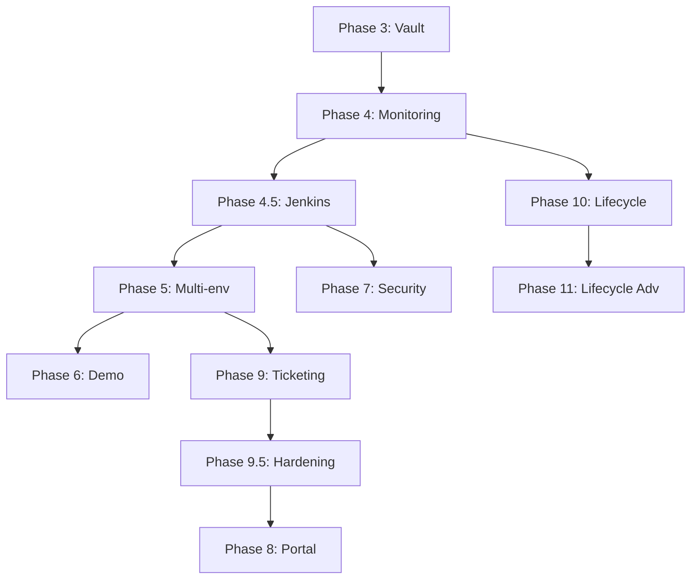

# Linear Import - STOA Platform v2

> **Generated on:** 2025-12-24
> **Source:** Linear (hlfh-workspace)
> **Project:** STOA Platform v2

---

## 🔗 Linear VSCode Extension

For Linear integration directly from VSCode:

### Installation
```bash
# Recommended extension: Linear by Strigo
code --install-extension strigo.linear
```

Or search for "Linear" in VSCode Extensions (Ctrl+Shift+X) → install **Linear by Strigo**.

### Configuration
1. Go to [Linear API Settings](https://linear.app/hlfh-workspace/settings/api)
2. Create a **Personal API Key**
3. In VSCode: `Cmd+Shift+P` → "Linear: Set API Key"
4. Paste the key

### Available Commands
- `Linear: Create Issue` - Create an issue from VSCode
- `Linear: Open Issue` - Open an issue in Linear
- `Linear: Search Issues` - Search for issues

### Project Link
- **Workspace:** hlfh-workspace
- **Project:** [STOA Platform v2](https://linear.app/hlfh-workspace/project/stoa-platform-v2)

---

## 📊 Overview

| Metric | Value |
|--------|-------|
| Total Issues | 77 |
| Phases | 11 (Phase 3 → Phase 11) |
| Total Estimate | ~16-18 weeks |

---

## Linear Configuration

### Labels to Create

#### By Phase
- `phase:3` - Vault + Alias
- `phase:4` - OpenSearch + Monitoring
- `phase:4.5` - Jenkins Orchestration
- `phase:5` - Multi-environment
- `phase:6` - Demo Tenant
- `phase:7` - Security Jobs
- `phase:8` - Portal Self-Service
- `phase:9` - Ticketing ITSM
- `phase:9.5` - Production Readiness
- `phase:10` - Resource Lifecycle
- `phase:11` - Resource Lifecycle Advanced

#### By Type
- `type:feature` - New feature
- `type:integration` - System integration
- `type:security` - Security
- `type:infra` - Infrastructure
- `type:ui` - User interface
- `type:api` - Backend API
- `type:docs` - Documentation
- `type:playbook` - Ansible Playbook
- `type:test` - Tests
- `type:epic` - Epic

#### By Component
- `component:awx` - AWX/Ansible
- `component:vault` - HashiCorp Vault
- `component:kafka` - Kafka/Redpanda
- `component:keycloak` - Keycloak SSO
- `component:gateway` - Kong Gateway
- `component:gitlab` - GitLab
- `component:cp-ui` - Control Plane UI
- `component:cp-api` - Control Plane API
- `component:jenkins` - Jenkins Orchestration
- `component:terraform` - Infrastructure as Code
- `component:lambda` - AWS Lambda
- `component:n8n` - n8n Workflows
- `component:gatekeeper` - OPA Gatekeeper
- `component:opensearch` - OpenSearch
- `component:prometheus` - Prometheus
- `component:grafana` - Grafana

#### By Priority
- `prio:p0` - Critical (blocking)
- `prio:p1` - High
- `prio:p2` - Medium
- `prio:p3` - Low

---

## Milestones

| Milestone | Description | Phases |
|-----------|-------------|--------|
| **M1: Production-Ready** | Platform ready for production | 3, 4, 4.5, 9, 9.5 |
| **M2: Self-Service** | Autonomous developer portal | 5, 6, 8 |
| **M3: Full Automation** | Complete automation | 7 |
| **M4: Cost Optimization** | Cost and resource optimization | 10, 11 |

---

## 📅 Planning by Phase

| Phase | Name | Issues | Priority | Estimated Duration |
|-------|------|--------|----------|-------------------|
| 3 | Vault + Alias | 1 | P0 | 1 week |
| 4 | OpenSearch + Monitoring | 5 | P1 | 1.5 weeks |
| 4.5 | Jenkins Orchestration | 11 | P0 | 2 weeks |
| 5 | Multi-environment | 4 | P1 | 1 week |
| 6 | Demo Tenant | 2 | P2 | 0.5 week |
| 7 | Security Jobs | 2 | P2 | 1 week |
| 8 | Portal Self-Service | 2 | P1 | 2 weeks |
| 9 | Ticketing ITSM | 9 | P0 | 2 weeks |
| 9.5 | Production Readiness | 8 | P0 | 2 weeks |
| 10 | Resource Lifecycle | 11 | P1 | 2 weeks |
| 11 | Resource Lifecycle Advanced | 10 | P2 | 2 weeks |

---

## Current Project Status

### Completed Phases ✅

| Phase | Name | Status |
|-------|------|--------|
| Phase 1 | Infrastructure Foundation | ✅ Completed |
| Phase 2 | Event-Driven Core | ✅ Completed |
| Phase 2.5 | OpenAPI Compatibility | ✅ Completed |

### Phases To Do 📋

| Phase | Name | Priority | Estimate |
|-------|------|----------|----------|
| Phase 3 | Vault + Alias | P0 | 1 week |
| Phase 4 | OpenSearch + Monitoring | P1 | 1.5 weeks |
| Phase 4.5 | Jenkins Orchestration | P0 | 2 weeks |
| Phase 5 | Multi-environment | P1 | 1 week |
| Phase 6 | Demo Tenant | P2 | 0.5 week |
| Phase 7 | Security Jobs | P2 | 1 week |
| Phase 8 | Portal Self-Service | P1 | 2 weeks |
| Phase 9 | Ticketing ITSM | P0 | 2 weeks |
| Phase 9.5 | Production Readiness | P0 | 2 weeks |
| Phase 10 | Resource Lifecycle | P1 | 2 weeks |
| Phase 11 | Resource Lifecycle Advanced | P2 | 2 weeks |

---

## 📋 Issues by Phase

---

### Phase 3: Vault + Alias - Finalization

**Epic:** [CAB-6](https://linear.app/hlfh-workspace/issue/CAB-6)

#### Objective
Finalization of Vault integration for secrets and alias management.

#### Definition of Done
- [ ] Secrets managed via Vault
- [ ] Automatic credential rotation
- [ ] Aliases configured and functional
- [ ] Audit trail for secret access

---

### Phase 4: OpenSearch + Monitoring

**Epic:** [CAB-2](https://linear.app/hlfh-workspace/issue/CAB-2)

#### Objective
Set up centralized logging and monitoring with alerting.

#### Definition of Done
- [ ] Logs visible in OpenSearch
- [ ] Slack alerts functional

#### Issues

| ID | Title | Priority | Component |
|----|-------|----------|-----------|
| [CAB-9](https://linear.app/hlfh-workspace/issue/CAB-9) | APIM-401: Deploy Amazon OpenSearch on EKS | P0 | opensearch |
| [CAB-10](https://linear.app/hlfh-workspace/issue/CAB-10) | APIM-402: Configure FluentBit for log shipping | P0 | opensearch |
| [CAB-11](https://linear.app/hlfh-workspace/issue/CAB-11) | APIM-403: Deploy Prometheus + Grafana | P0 | prometheus |
| [CAB-12](https://linear.app/hlfh-workspace/issue/CAB-12) | APIM-404: Create OpenSearch dashboards | P1 | opensearch |

---

### Phase 4.5: Jenkins Orchestration Layer

**Epic:** [CAB-92](https://linear.app/hlfh-workspace/issue/CAB-92)

#### Objective
Jenkins orchestration layer between the Control Plane and AWX to manage deployment pipelines with approval gates.

#### Architecture
```
Control Plane API
       │
       ▼
   Kafka Topic
  (deploy-requests)
       │
       ▼
┌──────────────────┐
│ Jenkins Consumer │ (Python service)
└────────┬─────────┘
         │
         ▼
┌──────────────────┐
│ Jenkins Pipeline │
│  - Validate      │
│  - Approval Gate │ ◄── Production only
│  - AWX Trigger   │
│  - Notify        │
└────────┬─────────┘
         │
         ▼
┌──────────────────┐
│      AWX         │
│  (Playbooks)     │
└────────┬─────────┘
         │
         ▼
   Kong Gateway
```

#### Issues

| ID | Title | Priority | Estimate |
|----|-------|----------|----------|
| [CAB-93](https://linear.app/hlfh-workspace/issue/CAB-93) | Deploy Jenkins on EKS with JCasC | P0 | 2d |
| [CAB-94](https://linear.app/hlfh-workspace/issue/CAB-94) | Keycloak OIDC Integration for SSO | P0 | 1d |
| [CAB-95](https://linear.app/hlfh-workspace/issue/CAB-95) | Kafka Consumer Service → Jenkins Job Trigger | P0 | 3d |
| [CAB-96](https://linear.app/hlfh-workspace/issue/CAB-96) | Deploy API Pipeline with Approval Gates | P0 | 2d |
| [CAB-97](https://linear.app/hlfh-workspace/issue/CAB-97) | Rollback API Pipeline | P1 | 1d |
| [CAB-98](https://linear.app/hlfh-workspace/issue/CAB-98) | Shared Library reusable functions | P1 | 2d |
| [CAB-99](https://linear.app/hlfh-workspace/issue/CAB-99) | AWX Job Trigger Integration | P0 | 2d |
| [CAB-100](https://linear.app/hlfh-workspace/issue/CAB-100) | Prometheus Metrics and Grafana Dashboard | P2 | 1d |
| [CAB-101](https://linear.app/hlfh-workspace/issue/CAB-101) | Sync Gateway Configuration Pipeline | P2 | 1d |
| [CAB-102](https://linear.app/hlfh-workspace/issue/CAB-102) | Blue Ocean UI and job organization | P3 | 0.5d |

---

### Phase 5: Multi-environment

**Epic:** [CAB-3](https://linear.app/hlfh-workspace/issue/CAB-3)

#### Objective
Enable deployment promotion between environments via automated pipeline.

#### Definition of Done
- [ ] Promotion DEV → STAGING → PROD via pipeline

#### Issues

| ID | Title | Priority |
|----|-------|----------|
| [CAB-13](https://linear.app/hlfh-workspace/issue/CAB-13) | APIM-501: Create STAGING environment | P0 |
| [CAB-14](https://linear.app/hlfh-workspace/issue/CAB-14) | APIM-502: Playbook promote-environment.yaml | P0 |
| [CAB-15](https://linear.app/hlfh-workspace/issue/CAB-15) | APIM-503: AWX Job Template Promote API | P0 |

---

### Phase 6: Demo Tenant

**Epic:** [CAB-7](https://linear.app/hlfh-workspace/issue/CAB-7)

#### Objective
Demo tenant for testing and presentations.

#### Issues

| ID | Title | Priority |
|----|-------|----------|
| [CAB-24](https://linear.app/hlfh-workspace/issue/CAB-24) | APIM-601: Create demo tenant with beta users | P2 |

---

### Phase 7: Security Jobs

**Epic:** [CAB-8](https://linear.app/hlfh-workspace/issue/CAB-8)

#### Objective
Automated security jobs for platform hardening.

#### Issues

| ID | Title | Priority |
|----|-------|----------|
| [CAB-25](https://linear.app/hlfh-workspace/issue/CAB-25) | APIM-701: Docker image stoa-security-jobs | P1 |

---

### Phase 8: Portal Self-Service

**Epic:** [CAB-5](https://linear.app/hlfh-workspace/issue/CAB-5)

#### Objective
Self-service portal allowing developers to subscribe to APIs autonomously.

#### Definition of Done
- [ ] 1 external developer can subscribe in self-service

#### Issues

| ID | Title | Priority |
|----|-------|----------|
| [CAB-26](https://linear.app/hlfh-workspace/issue/CAB-26) | APIM-801: Setup Developer Portal project | P2 |

---

### Phase 9: Ticketing ITSM - CRITICAL FOR PROD

**Epic:** [CAB-4](https://linear.app/hlfh-workspace/issue/CAB-4)

#### ⚠️ CRITICAL FOR PROD
ITSM integration for production deployment validation.

#### Definition of Done
- [ ] **0 PROD deployments without approved ticket**

#### Backend Issues

| ID | Title | Priority |
|----|-------|----------|
| [CAB-16](https://linear.app/hlfh-workspace/issue/CAB-16) | APIM-901: PromotionRequest Model + Git Service | P0 |
| [CAB-17](https://linear.app/hlfh-workspace/issue/CAB-17) | APIM-902: API Endpoints /v1/requests/prod | P0 |
| [CAB-18](https://linear.app/hlfh-workspace/issue/CAB-18) | APIM-903: Approve/Reject Workflow with anti-self-approval | P0 |
| [CAB-19](https://linear.app/hlfh-workspace/issue/CAB-19) | APIM-904: AWX callback webhook for ticketing | P0 |

#### Frontend Issues

| ID | Title | Priority |
|----|-------|----------|
| [CAB-20](https://linear.app/hlfh-workspace/issue/CAB-20) | APIM-905: UI - Requests list page | P0 |
| [CAB-21](https://linear.app/hlfh-workspace/issue/CAB-21) | APIM-906: UI - New request form | P0 |
| [CAB-22](https://linear.app/hlfh-workspace/issue/CAB-22) | APIM-907: UI - Detail page + Approve/Reject | P0 |
| [CAB-23](https://linear.app/hlfh-workspace/issue/CAB-23) | APIM-908: Kafka Events + Notifications | P1 |

---

### Phase 9.5: Production Readiness (NEW)

**Epic:** [CAB-103](https://linear.app/hlfh-workspace/issue/CAB-103)

#### Objective
Prepare the APIM platform for production with all guarantees of reliability, security, and operability.

#### Definition of Done
- [ ] AWX Backup/Restore tested
- [ ] Vault Backup/Restore tested
- [ ] Load Test Pipeline operational
- [ ] Runbooks documented
- [ ] OWASP Security Scan passed
- [ ] Chaos Testing validated
- [ ] SLO/SLA documented

#### Issues

| ID | Title | Priority | Estimate |
|----|-------|----------|----------|
| [CAB-104](https://linear.app/hlfh-workspace/issue/CAB-104) | APIM-9501: Backup/Restore AWX | P0 | 2d |
| [CAB-105](https://linear.app/hlfh-workspace/issue/CAB-105) | APIM-9502: Backup/Restore Vault | P0 | 2d |
| [CAB-106](https://linear.app/hlfh-workspace/issue/CAB-106) | APIM-9503: Load Test Pipeline (K6/Gatling) | P0 | 3d |
| [CAB-107](https://linear.app/hlfh-workspace/issue/CAB-107) | APIM-9504: Operational Runbooks | P0 | 2d |
| [CAB-108](https://linear.app/hlfh-workspace/issue/CAB-108) | APIM-9505: Security Audit (OWASP) | P0 | 3d |
| [CAB-109](https://linear.app/hlfh-workspace/issue/CAB-109) | APIM-9506: Chaos Testing | P1 | 2d |
| [CAB-110](https://linear.app/hlfh-workspace/issue/CAB-110) | APIM-9507: SLO/SLA Definition | P0 | 1d |

#### Issue Details

##### APIM-9501: Backup/Restore AWX
```
Title: [AWX] Automated Backup/Restore
Priority: P0 - Urgent
Labels: phase:9.5, type:infra, component:awx, prio:p0
Milestone: M1: Production-Ready
Estimate: 2 days

Description:
Implement automated backup and restore for AWX.

Acceptance Criteria:
- [ ] AWX database backup script (PostgreSQL)
- [ ] Backup of credentials and inventories
- [ ] Backup of job templates and workflows
- [ ] Upload to S3 with encryption
- [ ] Kubernetes CronJob for daily backup
- [ ] Documented restore procedure
- [ ] Restore test validated on staging environment
- [ ] Retention policy (30 days)
```

##### APIM-9502: Backup/Restore Vault
```
Title: [Vault] Automated Backup/Restore
Priority: P0 - Urgent
Labels: phase:9.5, type:infra, component:vault, prio:p0
Milestone: M1: Production-Ready
Estimate: 2 days

Description:
Implement automated backup and restore for Vault.

Acceptance Criteria:
- [ ] Vault storage backend snapshot
- [ ] Backup of unseal keys (offline, secured)
- [ ] Backup of policies and auth methods
- [ ] Upload to S3 with KMS encryption
- [ ] Kubernetes CronJob for daily backup
- [ ] Documented restore procedure with unseal
- [ ] Restore test validated on staging environment
- [ ] Backup audit trail
```

##### APIM-9503: Load Test Pipeline
```
Title: [Test] Load Testing Pipeline
Priority: P0 - Urgent
Labels: phase:9.5, type:test, prio:p0
Milestone: M1: Production-Ready
Estimate: 3 days

Description:
Create a load testing pipeline to validate performance.

Acceptance Criteria:
- [ ] K6 or Gatling configured
- [ ] Test scenarios:
  - API CRUD operations
  - Authentication flow
  - Concurrent deployments
  - Kafka message throughput
- [ ] Performance thresholds defined:
  - p95 < 500ms for API calls
  - p99 < 1s for deployments
  - 0% error rate under normal load
- [ ] Jenkins job for on-demand execution
- [ ] HTML report generated
- [ ] Grafana integration for real-time metrics
```

##### APIM-9504: Operational Runbooks
```
Title: [Docs] Operational Runbooks
Priority: P0 - Urgent
Labels: phase:9.5, type:docs, prio:p0
Milestone: M1: Production-Ready
Estimate: 2 days

Description:
Document operational procedures for the support team.

Runbooks to create:
- Incident: API Gateway down
- Incident: AWX job failure
- Incident: Vault sealed
- Incident: High Kafka lag
- Procedure: Emergency rollback
- Procedure: Horizontal scaling
- Procedure: Secrets rotation
- Procedure: DR failover

Acceptance Criteria:
- [ ] Runbook per incident type
- [ ] Standardized format (symptoms, diagnosis, resolution)
- [ ] Screenshots and commands
- [ ] Escalation path defined
- [ ] Stored in docs/runbooks/
- [ ] Link from main README
```

##### APIM-9505: OWASP Security Audit
```
Title: [Security] OWASP Top 10 Audit
Priority: P0 - Urgent
Labels: phase:9.5, type:security, prio:p0
Milestone: M1: Production-Ready
Estimate: 3 days

Description:
Perform a security audit based on OWASP Top 10.

Acceptance Criteria:
- [ ] OWASP ZAP scan on Control Plane API
- [ ] OWASP ZAP scan on Control Plane UI
- [ ] SQL/NoSQL injection verification
- [ ] XSS verification
- [ ] CSRF verification
- [ ] Authentication/session verification
- [ ] Exposed secrets verification
- [ ] Vulnerability report
- [ ] Remediation plan for critical issues
- [ ] Re-scan after remediation
```

##### APIM-9506: Chaos Testing
```
Title: [Test] Chaos Testing
Priority: P1 - High
Labels: phase:9.5, type:test, prio:p1
Milestone: M1: Production-Ready
Estimate: 2 days

Description:
Validate platform resilience with chaos engineering.

Acceptance Criteria:
- [ ] Litmus Chaos or Chaos Mesh installed
- [ ] Chaos scenarios:
  - Pod kill (API, AWX, Vault)
  - Network latency injection
  - CPU/Memory stress
  - Kafka broker failure
- [ ] Auto-healing validation
- [ ] Alerting validation
- [ ] Results documentation
- [ ] Improvement recommendations
```

##### APIM-9507: SLO/SLA Definition
```
Title: [Docs] SLO/SLA Definition
Priority: P0 - Urgent
Labels: phase:9.5, type:docs, prio:p0
Milestone: M1: Production-Ready
Estimate: 1 day

Description:
Define SLOs and SLAs for the APIM platform.

Proposed SLOs:
- Availability: 99.9% (8.76h downtime/year)
- API Latency p95: < 500ms
- Deployment Success Rate: > 99%
- MTTR: < 1h for P1
- Error Rate: < 0.1%

Acceptance Criteria:
- [ ] SLOs documented with metrics
- [ ] Draft SLA for clients
- [ ] Error budget defined
- [ ] Alerts configured for SLO breach
- [ ] SLO dashboard in Grafana
- [ ] Quarterly review planned
```

---

### Phase 10: Resource Lifecycle Management

**Epic:** [CAB-27](https://linear.app/hlfh-workspace/issue/CAB-27)

#### Objective
Cost optimization and automated cloud resource lifecycle management.

#### Definition of Done
- [ ] **20% cost reduction on unused cloud resources**
- [ ] **100% of resources tagged according to policy**

#### Mandatory Tags (8)
| Tag | Description | Values |
|-----|-------------|--------|
| `environment` | Environment | dev\|test\|staging\|sandbox\|poc\|demo\|prod |
| `owner` | Owner email | email |
| `project` | Project name | string |
| `cost-center` | Cost center | string |
| `ttl` | Time to live (days) | 1-30 |
| `created_at` | Creation timestamp | ISO 8601 |
| `auto-teardown` | Auto deletion | true\|false |
| `data-class` | Data classification | public\|internal\|confidential\|restricted |

#### Rules
- `data-class=restricted` → `auto-teardown=false`
- Max TTL 30 days for non-prod
- `now > created_at + ttl` → deletion

#### Issues

| ID | Title | Priority |
|----|-------|----------|
| [CAB-28](https://linear.app/hlfh-workspace/issue/CAB-28) | APIM-1001: Terraform common_tags Module | P1 |
| [CAB-29](https://linear.app/hlfh-workspace/issue/CAB-29) | APIM-1002: Lambda Resource Cleanup | P1 |
| [CAB-30](https://linear.app/hlfh-workspace/issue/CAB-30) | APIM-1003: EventBridge Schedule | P1 |
| [CAB-31](https://linear.app/hlfh-workspace/issue/CAB-31) | APIM-1004: Owner Expiration Notifications | P1 |
| [CAB-32](https://linear.app/hlfh-workspace/issue/CAB-32) | APIM-1005: OPA Gatekeeper Policies | P1 |
| [CAB-33](https://linear.app/hlfh-workspace/issue/CAB-33) | APIM-1006: GitHub Actions Tag Governance | P2 |
| [CAB-34](https://linear.app/hlfh-workspace/issue/CAB-34) | APIM-1007: Kafka Events Resource Lifecycle | P2 |
| [CAB-35](https://linear.app/hlfh-workspace/issue/CAB-35) | APIM-1008: Grafana Dashboard Resource Lifecycle | P2 |
| [CAB-36](https://linear.app/hlfh-workspace/issue/CAB-36) | APIM-1009: n8n Multi-Cloud Workflow (optional) | P3 |
| [CAB-37](https://linear.app/hlfh-workspace/issue/CAB-37) | APIM-1010: Tagging Policy Documentation | P2 |

---

### Phase 11: Resource Lifecycle Advanced

**Epic:** [CAB-82](https://linear.app/hlfh-workspace/issue/CAB-82)

#### Objective
Extension of Phase 10 with advanced resource lifecycle management features.

#### Issues

| ID | Title | Priority |
|----|-------|----------|
| [CAB-83](https://linear.app/hlfh-workspace/issue/CAB-83) | Quotas per project/tenant | P2 |
| [CAB-84](https://linear.app/hlfh-workspace/issue/CAB-84) | Whitelist never-delete resources | P1 |
| [CAB-85](https://linear.app/hlfh-workspace/issue/CAB-85) | Ordered destruction with dependencies | P1 |
| [CAB-86](https://linear.app/hlfh-workspace/issue/CAB-86) | Self-service TTL Extension endpoint | P2 |
| [CAB-87](https://linear.app/hlfh-workspace/issue/CAB-87) | Snooze buttons in emails | P2 |
| [CAB-88](https://linear.app/hlfh-workspace/issue/CAB-88) | Avoided cost calculator | P2 |
| [CAB-89](https://linear.app/hlfh-workspace/issue/CAB-89) | Cost Savings Dashboard | P2 |
| [CAB-90](https://linear.app/hlfh-workspace/issue/CAB-90) | Complete n8n Workflow with Notion | P3 |
| [CAB-91](https://linear.app/hlfh-workspace/issue/CAB-91) | Hourly cron pre-alerts | P3 |

---

## 🔗 Dependencies Between Phases



---

## Dependencies Between Issues

```
# Phase 4.5 Jenkins
CAB-94 (Keycloak SSO) ──depends on──► CAB-93 (Jenkins Deploy)
CAB-95 (Kafka Consumer Jenkins) ──depends on──► CAB-93 (Jenkins Deploy)
CAB-96 (Deploy Pipeline) ──depends on──► CAB-98 (Shared Library)
CAB-96 (Deploy Pipeline) ──depends on──► CAB-99 (AWX Integration)
CAB-97 (Rollback Pipeline) ──depends on──► CAB-98 (Shared Library)
CAB-100 (Jenkins Metrics) ──depends on──► CAB-93 (Jenkins Deploy)
CAB-101 (Sync Gateway) ──depends on──► CAB-98 (Shared Library)
CAB-102 (Blue Ocean) ──depends on──► CAB-96 (Deploy Pipeline)

# Phase 9 Ticketing
CAB-17 (API Endpoints) ──depends on──► CAB-16 (Model)
CAB-18 (Workflow) ──depends on──► CAB-17 (API Endpoints)
CAB-19 (AWX Callback) ──depends on──► CAB-18 (Workflow)
CAB-20 (UI List) ──depends on──► CAB-17 (API Endpoints)
CAB-21 (UI Form) ──depends on──► CAB-20 (UI List)
CAB-22 (UI Detail) ──depends on──► CAB-21 (UI Form)
CAB-23 (Kafka Events) ──depends on──► CAB-18 (Workflow)

# Phase 9.5 Production Readiness
CAB-106 (Load Test) ──depends on──► CAB-93 (Jenkins)
CAB-108 (Security Audit) ──depends on──► CAB-17 (API)
CAB-109 (Chaos Testing) ──depends on──► CAB-106 (Load Test)

# Phase 10 Resource Lifecycle
CAB-29 (Lambda) ──depends on──► CAB-28 (Tags Module)
CAB-30 (EventBridge) ──depends on──► CAB-29 (Lambda)
CAB-31 (Notifications) ──depends on──► CAB-29 (Lambda)
CAB-34 (Kafka Events) ──depends on──► CAB-29 (Lambda)
CAB-35 (Grafana) ──depends on──► CAB-34 (Kafka Events)
CAB-36 (n8n) ──depends on──► CAB-28 (Tags Module) [Alternative]

# Phase 11 dependencies
CAB-84 (Whitelist) ──depends on──► CAB-29 (Lambda Cleanup)
CAB-85 (Ordered Destroy) ──depends on──► CAB-29 (Lambda Cleanup)
CAB-86 (TTL Extension) ──depends on──► CAB-31 (Notifications)
CAB-87 (Snooze Buttons) ──depends on──► CAB-86 (TTL Extension)
CAB-88 (Cost Calculator) ──depends on──► CAB-29 (Lambda Cleanup)
CAB-89 (Cost Dashboard) ──depends on──► CAB-88 (Cost Calculator)
CAB-90 (n8n Notion) ──depends on──► CAB-36 (n8n Basic)
CAB-91 (Cron Hourly) ──depends on──► CAB-30 (EventBridge)
```

---

## Recommended Execution Order

### Sprint 1 (Weeks 1-2): Foundation
1. Phase 3: Vault + Alias (CAB-6)
2. Phase 4: OpenSearch + Monitoring (CAB-9 → CAB-12)

### Sprint 2 (Weeks 2-4): Jenkins Orchestration
1. CAB-93 → CAB-94 (Jenkins Deploy + SSO)
2. CAB-98 → CAB-99 (Shared Library + AWX Integration)
3. CAB-95 (Kafka Consumer Jenkins)
4. CAB-96 → CAB-97 (Deploy + Rollback Pipelines)
5. CAB-100, CAB-101, CAB-102 (parallelizable)

### Sprint 3 (Weeks 4-5): Multi-Env + Demo
1. Phase 5: CAB-13 → CAB-14 → CAB-15
2. Phase 6: CAB-24 (Demo Tenant)

### Sprint 4 (Weeks 5-7): Ticketing ITSM
1. CAB-16 → CAB-17 → CAB-18 → CAB-19 (Backend)
2. CAB-20 → CAB-21 → CAB-22 → CAB-23 (Frontend)

### Sprint 5 (Weeks 7-9): Production Readiness
1. CAB-104, CAB-105 (Backup AWX + Vault) - parallelizable
2. CAB-106 (Load Testing)
3. CAB-107 (Runbooks)
4. CAB-108 (Security Audit)
5. CAB-109 (Chaos Testing)
6. CAB-110 (SLO/SLA)

### Sprint 6 (Weeks 9-10): Security + Portal
1. Phase 7: CAB-25 (Security Jobs)
2. Phase 8: CAB-26 (Portal Setup)

### Sprint 7-8 (Weeks 10-12): Resource Lifecycle (Phase 10)
1. CAB-28 → CAB-29 → CAB-30 (sequential)
2. CAB-31, CAB-32, CAB-33 (parallelizable after CAB-29)
3. CAB-34 → CAB-35 (sequential)
4. CAB-36 (optional, if multi-cloud required)
5. CAB-37 (documentation, continuous)

### Sprint 9 (Weeks 12-14): Resource Lifecycle Advanced (Phase 11)
1. CAB-83 (Quotas) - independent
2. CAB-84 → CAB-85 (Whitelist → Ordered Destroy)
3. CAB-86 → CAB-87 (TTL Extension → Snooze Buttons)
4. CAB-88 → CAB-89 (Cost Calculator → Dashboard)
5. CAB-90 (n8n Notion) - after Phase 10 CAB-36
6. CAB-91 (Cron Hourly) - optional

---

## 📊 Distribution by Priority

| Priority | Count | % |
|----------|-------|---|
| P0 (Critical) | 28 | 36% |
| P1 (High) | 25 | 32% |
| P2 (Medium) | 18 | 23% |
| P3 (Low) | 6 | 8% |

---

## 📁 Recommended GitOps Structure

```
stoa-platform/
├── .github/
│   └── workflows/
│       └── tag-governance.yaml
├── terraform/
│   ├── modules/
│   │   ├── common_tags/
│   │   └── project_quotas/
│   └── environments/
│       ├── dev/
│       ├── staging/
│       └── prod/
├── ansible/
│   ├── playbooks/
│   │   ├── deploy-api.yaml
│   │   ├── promote-environment.yaml
│   │   └── rollback-api.yaml
│   └── roles/
├── jenkins/
│   ├── pipelines/
│   │   ├── deploy-api.groovy
│   │   ├── rollback-api.groovy
│   │   └── sync-gateway.groovy
│   └── shared-library/
├── k8s/
│   ├── base/
│   └── overlays/
│       ├── dev/
│       ├── staging/
│       └── prod/
├── docs/
│   ├── runbooks/
│   └── tagging-policy.md
└── config/
    └── whitelist.yaml
```

---

## Notes

- Estimates are indicative and may vary based on actual complexity
- Dependencies must be respected to avoid blockers
- Each issue should have associated tests (not listed here)
- Documentation must be updated at each completed phase

---

*Document synchronized with Linear - Last updated: 2025-12-24*
