# Platform Architecture — Dependency Graph

> Auto-generated from `docs/platform-catalog.yaml` by `scripts/ops/catalog-graph.sh`.
> Last catalog update: 2026-03-29. Do not edit manually.

## Service Dependencies

```mermaid
graph TD
    %% Style definitions
    classDef backend fill:#4f46e5,stroke:#312e81,color:#fff
    classDef frontend fill:#059669,stroke:#064e3b,color:#fff
    classDef gateway fill:#dc2626,stroke:#7f1d1d,color:#fff
    classDef database fill:#d97706,stroke:#78350f,color:#fff
    classDef identity fill:#7c3aed,stroke:#4c1d95,color:#fff
    classDef monitoring fill:#0284c7,stroke:#0c4a6e,color:#fff
    classDef messaging fill:#ea580c,stroke:#7c2d12,color:#fff
    classDef external fill:#6b7280,stroke:#374151,color:#fff

    control_plane_api["Control Plane API"]
    class control_plane_api backend
    control_plane_ui["Console (Admin UI)"]
    class control_plane_ui frontend
    stoa_portal["Developer Portal"]
    class stoa_portal frontend
    stoa_gateway["STOA Gateway (Rust)"]
    class stoa_gateway gateway
    stoa_link_wm["STOA Link — webMethods (Sidecar)"]
    stoa_connect["STOA Connect (Go Agent)"]
    stoa_operator["STOA Operator"]
    class stoa_operator external
    webmethods["webMethods API Gateway (Trial)"]
    class webmethods gateway
    postgres["PostgreSQL"]
    class postgres database
    redpanda["Redpanda (Kafka)"]
    class redpanda messaging
    opensearch["OpenSearch"]
    class opensearch database
    keycloak["Keycloak (OIDC)"]
    class keycloak identity
    vault["HashiCorp Vault"]
    class vault identity
    infisical["Infisical (Legacy Secrets)"]
    class infisical identity
    openldap["OpenLDAP"]
    prometheus["Prometheus"]
    class prometheus monitoring
    grafana["Grafana"]
    class grafana monitoring
    loki["Loki (Logs)"]
    class loki monitoring
    opensearch_dashboards["OpenSearch Dashboards (STOA Logs)"]
    class opensearch_dashboards monitoring
    argocd["ArgoCD"]
    class argocd external
    n8n["n8n (Workflow Engine)"]
    class n8n external
    netbox["Netbox (IPAM)"]
    uptime_kuma["Uptime Kuma (Status Page)"]

    %% Dependencies
    control_plane_api --> postgres
    control_plane_api --> keycloak
    control_plane_api --> redpanda
    control_plane_api --> opensearch
    control_plane_ui --> control_plane_api
    control_plane_ui --> keycloak
    stoa_portal --> control_plane_api
    stoa_portal --> keycloak
    stoa_gateway --> control_plane_api
    stoa_gateway --> keycloak
    stoa_gateway --> redpanda
    stoa_link_wm --> control_plane_api
    stoa_link_wm --> webmethods
    stoa_connect --> control_plane_api
    stoa_connect --> webmethods
    stoa_operator --> control_plane_api
    keycloak --> postgres
    grafana --> prometheus
    grafana --> loki
    opensearch_dashboards --> opensearch
```

## Service Inventory Summary

| Type | Count | Services |
|------|-------|----------|
| backend | 1 | control-plane-api |
| frontend | 2 | control-plane-ui, stoa-portal |
| gateway | 1 | stoa-gateway |
| database | 1 | postgres |
| identity | 1 | keycloak |
| monitoring | 3 | prometheus, grafana, opensearch-dashboards |
| messaging | 1 | redpanda |
| automation | 1 | n8n |
| gitops | 1 | argocd |
| operator | 1 | stoa-operator |
| search | 1 | opensearch |
| logging | 1 | loki |
| secrets | 2 | vault, infisical |
| gateway-external | 1 | webmethods |

## Cluster Topology

| Cluster | Provider | Nodes | Namespaces/Hosts |
|---------|----------|-------|------------------|
| OVH Managed Kubernetes (GRA9) | OVH | 3 | 5 |
| K3s Gateway Cluster (Contabo) | Contabo | 2 | 2 |
| OVH VPS Fleet | OVH | 3 | 3 |
| Contabo VPS (HEGEMON Workers) | Contabo | 5 | 5 |
| OVH VPS (Vault) | OVH | 1 | 1 |
