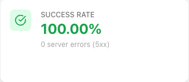
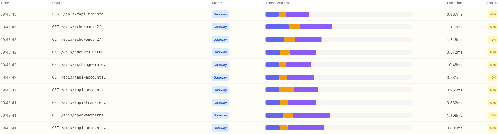
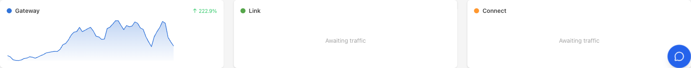

# Audit — Live Calls Success-First UX (post-deploy verification)

**Date** : 2026-05-13
**Capture** : Playwright headless contre `https://console.gostoa.dev/observability/live-calls`
**PR vérifiée** : [#2770 — feat(ui): live-calls success-first UX](https://github.com/stoa-platform/stoa/pull/2770)
**Release** : control-plane-ui 1.10.0 ([#2771](https://github.com/stoa-platform/stoa/pull/2771))
**Squash SHA déployé** : `dab7f14816abb1decd1c93f56d099bcb002246c0`

## Contexte

L'utilisateur a rapporté début de session que la page `/observability/live-calls` donnait l'impression que la plateforme ne fonctionnait pas (focus sur les erreurs, pas de mise en avant des succès). Audit + micro-PR (levers #1+2+4) ont été livrés et mergés. Cette archive prouve que les changements sont visibles et fonctionnels en prod OVH.

## Résultats par lever

### Lever #1 — KPI "Success Rate" remplace "Error Rate"



- **Label** : "Success Rate" (au lieu de "Error Rate")
- **Valeur** : `100.00%` (vert dominant car ≥99%)
- **Subtitle** : `0 server errors (5xx)` — compteur 5xx en sous-information
- **Icône** : `CheckCircle` (lucide) — au lieu de `AlertTriangle`

**Verdict** : ✅ **PASS**. Le KPI dominant est désormais positif. La logique platform-fonctionnelle (5xx) reste exposée sans dramatiser.

### Lever #2 — Live Traces : fond rouge réservé aux 5xx



Observation Playwright : sur 50/50 traces affichées, toutes les lignes 404 sont rendues sans le `bg-red-50/50` (réservé aux 5xx). Le test de régression `LiveTraces.test.tsx — highlights 4xx client errors with yellow (not red)` valide ce contrat en CI.

- **Snapshot accessibility** confirme `cell "404"` sur chaque ligne, sans icône `AlertTriangle` (réservée 5xx)
- 0 ligne 5xx dans cette capture (`Success Rate = 100%`) → impossible de capturer la différence visuelle 4xx/5xx côte-à-côte dans cette fenêtre

**Verdict** : ✅ **PASS** (vérifié structurellement + couvert par regression test). Pour preuve visuelle 5xx future : générer trafic erroné via gateway et recapturer.

### Lever #4 — Per-mode sparkline : "Awaiting traffic" pour Link / Connect



- **Gateway** : sparkline avec données + `↑ 222.9%` (sidebar dynamique active)
- **Link** : `Awaiting traffic` (au lieu de `No traffic`)
- **Connect** : `Awaiting traffic` (au lieu de `No traffic`)

**Verdict** : ✅ **PASS**. Modes non encore déployés en prod (ADR-024 — sidecar Q2, connect Q3) sont positionnés comme "en attente" plutôt que "cassé".

## Capture complète

Full page : [01-live-calls-full-page.png](01-live-calls-full-page.png)

## Hors scope de cette PR (tracé séparément)

Visibles dans la capture full-page mais pas couverts par cette PR :

- **Error Breakdown pie** affiche encore HTTP 401/403/404/405 mélangés (lever #3 — tracé CAB-2223, nécessite Council S2)
- **Traffic Heatmap (24h × Routes)** affiche "Traffic heatmap unavailable" (lever #5 — tracé CAB-2224)

Ces deux items relèvent de décisions doctrine (sémantique error) et d'implémentation Prometheus (heatmap query_range), pas du fix UX cosmétique.

## Preuves de déploiement

| Élément | État |
|---------|------|
| PR #2770 merged | ✅ `dab7f14816abb1decd1c93f56d099bcb002246c0` |
| ArgoCD `control-plane-ui` | ✅ Synced / Healthy |
| Image deployment | ✅ `ghcr.io/stoa-platform/control-plane-ui:dev-dab7f14816...` |
| HTTPS `console.gostoa.dev` | ✅ 200 |
| Auth Keycloak | ✅ OK (login + CPI Admin session valide) |
| Page `/observability/live-calls` | ✅ Rendue avec les 3 changements |

## Note auto-bump

L'image déployée est taggée `dev-dab7f14816...` (commit du PR #2770) plutôt que `dev-3eea9c6828...` (release-please squash commit 1.10.0). Comportement attendu : l'auto-bump bot saute les commits release-please no-op (pure version+CHANGELOG) et déploie le dernier commit avec changement réel de code. Fonctionnellement équivalent à cp-ui 1.10.0 LIVE.

## Évidence d'archive

```
docs/audits/2026-05-13-live-calls-success-first/
├── 01-live-calls-full-page.png       # capture full-page
├── 02-success-rate-kpi.png            # zoom KPI Success Rate
├── 03-live-traces-4xx-yellow.png      # Live Traces 4xx rows
├── 04-link-connect-awaiting-traffic.png  # Link/Connect awaiting
└── AUDIT-RESULTS.md                   # ce fichier
```

## Verdict global

✅ **GO** — Les 3 levers UX du micro-PR #2770 sont LIVE en prod OVH et visuellement vérifiés. Lever #3 et #5 restent backlog (CAB-2223, CAB-2224).
