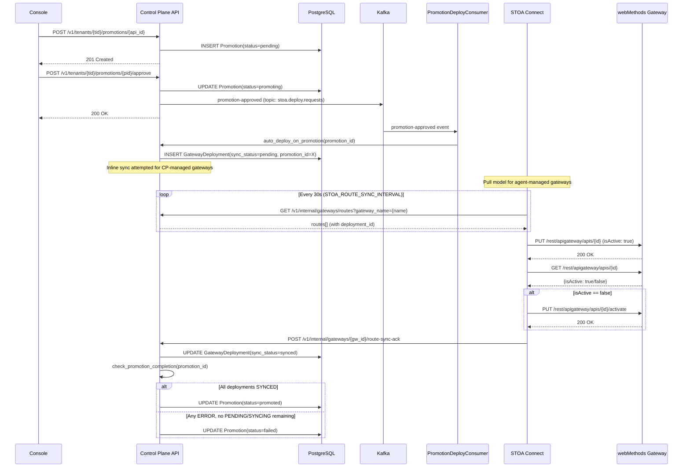
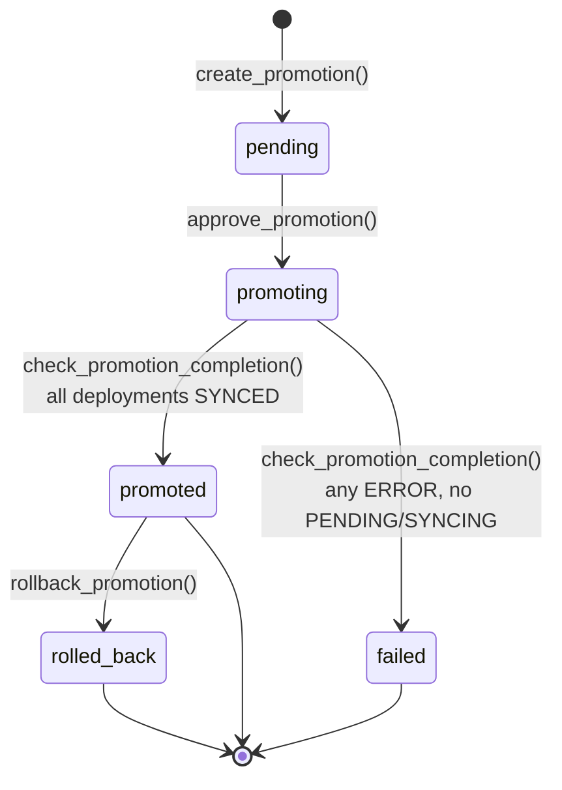
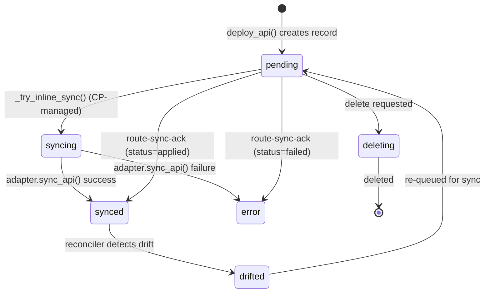

# Promotion Flow — End-to-End

## Overview

The promotion flow moves an API deployment from one environment to another (e.g., staging to production) with a closed-loop guarantee: the Control Plane tracks every deployment until the target gateway confirms success or failure. This guide covers the full lifecycle from promotion creation to automatic status resolution, for both CP-managed gateways (inline sync) and agent-managed gateways (STOA Connect pull model).

**Audience:** Backend engineers working on the Control Plane API, STOA Connect agent, or gateway adapters.

## Sequence Diagram

## State Machines

### Promotion Status

**Transitions:**

| From | To | Trigger | Guard |
|------|----|---------|-------|
| `pending` | `promoting` | `approve_promotion()` | 4-eyes: `requested_by != approved_by` for production target |
| `promoting` | `promoted` | `check_promotion_completion()` | All linked GatewayDeployments have `sync_status = synced` |
| `promoting` | `failed` | `check_promotion_completion()` | No `pending`/`syncing` remain, at least one `error` |
| `promoted` | `rolled_back` | `rollback_promotion()` | Creates reverse Promotion with swapped source/target |

### GatewayDeployment sync_status

**Enum values:** `pending`, `syncing`, `synced`, `drifted`, `error`, `deleting`

## Endpoints

| Method | Path | Auth | Description |
|--------|------|------|-------------|
| POST | `/v1/tenants/{tenant_id}/promotions/{api_id}` | Bearer JWT + `APIS_PROMOTE` | Create promotion |
| GET | `/v1/tenants/{tenant_id}/promotions` | Bearer JWT + tenant | List promotions |
| GET | `/v1/tenants/{tenant_id}/promotions/{promotion_id}` | Bearer JWT + tenant | Get promotion details |
| GET | `/v1/tenants/{tenant_id}/promotions/{promotion_id}/diff` | Bearer JWT + tenant | Get spec diff |
| POST | `/v1/tenants/{tenant_id}/promotions/{promotion_id}/approve` | Bearer JWT + `APIS_PROMOTE` | Approve (triggers deploy) |
| POST | `/v1/tenants/{tenant_id}/promotions/{promotion_id}/complete` | Bearer JWT + `APIS_PROMOTE` | Manual completion |
| POST | `/v1/tenants/{tenant_id}/promotions/{promotion_id}/rollback` | Bearer JWT + `APIS_PROMOTE` | Rollback (creates reverse promotion) |
| GET | `/v1/internal/gateways/routes` | `X-Gateway-Key` | STOA Connect route pull |
| POST | `/v1/internal/gateways/{gateway_id}/route-sync-ack` | `X-Gateway-Key` | Route deployment ack |
| POST | `/v1/internal/gateways/{gateway_id}/sync-ack` | `X-Gateway-Key` | Policy deployment ack |

## Models and Migrations

### Promotion

| Column | Type | Nullable | Notes |
|--------|------|----------|-------|
| `id` | UUID | No | PK, auto uuid4 |
| `tenant_id` | String(255) | No | Indexed (composite) |
| `api_id` | String(255) | No | |
| `source_environment` | String(50) | No | |
| `target_environment` | String(50) | No | |
| `source_deployment_id` | UUID FK | Yes | |
| `target_deployment_id` | UUID FK | Yes | |
| `status` | String(50) | No | Default `"pending"` |
| `spec_diff` | JSONB | Yes | |
| `message` | Text | No | |
| `requested_by` | String(255) | No | |
| `approved_by` | String(255) | Yes | |
| `completed_at` | DateTime | Yes | |
| `created_at` | DateTime | No | |
| `updated_at` | DateTime | No | |

**Constraints:** Partial unique index `uq_promotions_active_per_target` on (`api_id`, `target_environment`) WHERE `status IN ('pending', 'promoting')` — prevents concurrent promotions to the same target.

### GatewayDeployment

| Column | Type | Nullable | Notes |
|--------|------|----------|-------|
| `id` | UUID | No | PK |
| `api_catalog_id` | UUID FK | No | CASCADE delete |
| `gateway_instance_id` | UUID FK | No | CASCADE delete |
| `desired_state` | JSONB | No | |
| `actual_state` | JSONB | Yes | |
| `sync_status` | Enum | No | Default `"pending"` |
| `sync_error` | Text | Yes | |
| `sync_attempts` | Integer | No | Default `0` |
| `policy_sync_status` | Enum | Yes | |
| `policy_sync_error` | Text | Yes | |
| `promotion_id` | UUID FK | Yes | FK to `promotions.id`, SET NULL on delete, indexed |
| `gateway_resource_id` | String(255) | Yes | Assigned by gateway |
| `created_at` | DateTime(tz) | No | |
| `updated_at` | DateTime(tz) | No | |

**Constraint:** Unique on (`api_catalog_id`, `gateway_instance_id`).

### Migrations

| Migration | Description |
|-----------|-------------|
| 014 | Initial `gateway_deployments` table |
| 080 | Add `policy_sync_status` column |
| 081 | Add `promotion_id` FK + index `ix_gw_deploy_promotion` |

Migration 081 details:
- Adds column `promotion_id` (`UUID`, nullable, FK to `promotions.id`, `ondelete="SET NULL"`)
- Creates index `ix_gw_deploy_promotion` on `gateway_deployments.promotion_id`
- Down revision: `080_add_policy_sync_status`

## Push vs Pull Model

| Aspect | Push (Inline Sync) | Pull (STOA Connect) |
|--------|-------------------|---------------------|
| **Gateways** | CP-managed (Kong, Gravitee via adapter) | Agent-managed (webMethods, Kong, Gravitee via STOA Connect) |
| **Trigger** | `_try_inline_sync()` after `deploy_api()` | STOA Connect polls every 30s (`STOA_ROUTE_SYNC_INTERVAL`) |
| **Endpoint** | Direct HTTP to gateway admin API | `GET /v1/internal/gateways/routes` |
| **Feedback** | Immediate — updates `sync_status` in DB directly | Async — `POST /route-sync-ack` after apply |
| **Promotion completion** | Does NOT trigger `check_promotion_completion()` | Triggers `check_promotion_completion()` via ack |
| **SyncEngine behavior** | Processes pending deployments | Skips `source=self_register` gateways |
| **Optimization** | None | `SpecHash` dedup — skips routes where hash unchanged |

## Promotion Completion Logic

`PromotionService.check_promotion_completion(promotion_id)` (promotion_service.py:207-242):

1. Fetches all `GatewayDeployment` records WHERE `promotion_id = X`
2. If no deployments: no-op (returns)
3. If any status is `pending` or `syncing`: no-op (still waiting)
4. If all statuses are `synced`: calls `complete_promotion()` -> status = `promoted`, `completed_at = utcnow()`
5. Otherwise (at least one `error`, no `pending`/`syncing`): calls `fail_promotion()` with reason `"Partial deployment failure: {error_count}/{total} gateways failed"`
6. Both transitions catch `ValueError` silently (idempotent — already completed)

## Error Handling

### Partial failure

When multiple gateways are targeted, each gateway's deployment is tracked independently. If gateway A reports `applied` and gateway B reports `failed`, the overall promotion transitions to `failed` with a message indicating `1/2 gateways failed`.

### Race conditions

Two `route-sync-ack` calls for the same promotion can arrive concurrently. The state machine guards in `complete_promotion()` and `fail_promotion()` use status checks and catch `ValueError` on re-entry, making the transition idempotent.

### Fire-and-forget degraded mode

In STOA Connect (Go), `ReportRouteSyncAck()` is fire-and-forget: if the POST to `route-sync-ack` fails (network error, CP down), the agent logs a warning but does not abort. The routes are already applied locally. On the next poll cycle, the CP will still serve the same routes (already applied — SpecHash dedup skips them), and the ack will be retried implicitly.

### webMethods verify+activate

After creating or updating an API, the webMethods adapter calls `GET /rest/apigateway/apis/{id}` to check `isActive`. If `false`, it calls `PUT /rest/apigateway/apis/{id}/activate`. If activation fails, `SyncRoutes` returns an error, and the ack reports `status=failed` for all routes in the batch.

### Kafka consumer resilience

`PromotionDeployConsumer` uses `auto_commit=True` and `auto_offset_reset="latest"`. If the consumer crashes and restarts, it resumes from the latest offset (may miss messages). Missed promotions stay `promoting` until manual intervention or the next approval triggers reprocessing.

## Testing

### Unit Tests (Python)

| File | Class | Tests | Focus |
|------|-------|-------|-------|
| `test_gateway_internal.py` | `TestRouteSyncAck` | 4 | Basic ack: success, failed, mixed, not found |
| `test_gateway_internal.py` | `TestRouteSyncAckPromotionCompletion` | 5 | Promotion triggers: complete, partial, all synced, error, mixed |
| `test_gateway_internal.py` | `TestGatewaySyncAck` | 4 | Policy ack (related) |

### Integration Tests (Python)

| File | Class | Tests | Focus |
|------|-------|-------|-------|
| `test_integration_promotion_chain.py` | `TestPromotionChainIntegration` | 5 | Full chain: happy path single/multi-gateway, partial failure, state machine guard, idempotence |

### Go Tests

| File | Relevant Tests | Focus |
|------|---------------|-------|
| `webmethods_test.go` | `TestWebMethodsSyncRoutes` | Route upsert |
| `webmethods_test.go` | `TestWebMethodsSyncRoutesVerifiesActiveAfterCreate` | Post-deploy verify |
| `webmethods_test.go` | `TestWebMethodsSyncRoutesActivatesIfNotActive` | Activate fallback |
| `webmethods_test.go` | `TestWebMethodsSyncRoutesFailsIfActivateFails` | Activate failure path |
| `webmethods_test.go` | `TestWebMethodsActivateDeactivate` | Activate/deactivate API |
| `webmethods_test.go` | `TestWebMethodsSyncRoutesWithDeactivation` | Deactivation flow |
| `webmethods_test.go` | `TestWebMethodsSyncRoutesIdempotent` | Idempotent upsert |
| `webmethods_test.go` | `TestWebMethodsSyncRoutesSpecHashSkip` | SpecHash dedup |
| `webmethods_test.go` | `TestWebMethodsOpenAPI31Downgrade` | 3.1 -> 3.0.3 rewrite |

### Live Verification Checklist

1. Apply migration 081: `alembic upgrade head`
2. Create a promotion via Console or API
3. Approve the promotion (4-eyes for production)
4. Verify Kafka message published (`promotion-approved`)
5. Verify `GatewayDeployment` created with `promotion_id` set
6. Wait for STOA Connect poll (~30s)
7. Check STOA Connect logs for `SyncRoutes` + `ReportRouteSyncAck`
8. Verify `GatewayDeployment.sync_status` transitions to `synced`
9. Verify `Promotion.status` transitions to `promoted`
