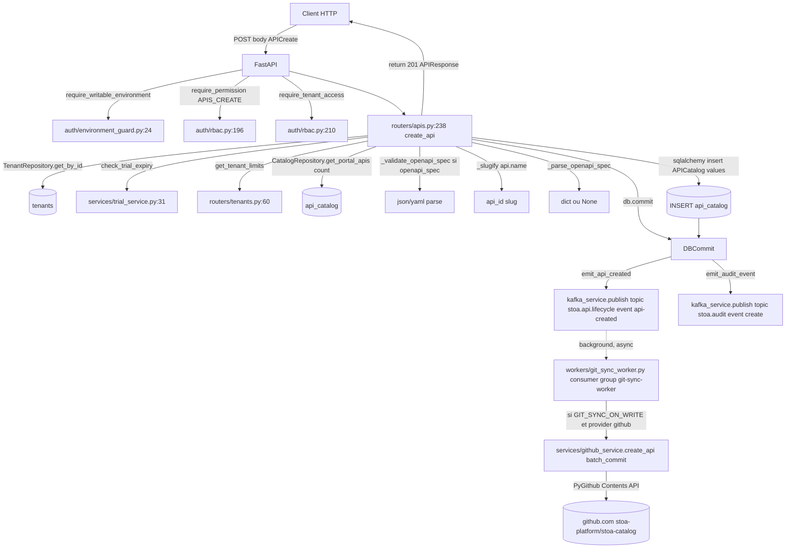

# 01 — Call graph `POST /v1/tenants/{tenant_id}/apis`

> Phase 1 audit, read-only. Files cited at `path:line`. The handler is in
> `control-plane-api/src/routers/apis.py`.

## 1. Entry point

- Router prefix : `control-plane-api/src/routers/apis.py:38`
  - `APIRouter(prefix="/v1/tenants/{tenant_id}/apis", tags=["APIs"])`
- Handler : `control-plane-api/src/routers/apis.py:235-358`
  - Decorators : `@router.post("", response_model=APIResponse, dependencies=[Depends(require_writable_environment)])`,
    `@require_permission(Permission.APIS_CREATE)`, `@require_tenant_access`
- Request schema : `APICreate` (`apis.py:41-48`) — fields `name, display_name, version, description, backend_url, openapi_spec, tags`. Pas de `paths`/`endpoints`/`tenant_id` côté Pydantic — la spec AT-1 envoie `protocol` et `paths[]`, **acceptés et silencieusement ignorés** par Pydantic v2 (model par défaut, pas `extra=forbid`).
- Response schema : `APIResponse` (`apis.py:60-79`) — retourne `id`, `tenant_id`, `name`, `display_name`, `version`, `description`, `backend_url`, `status`, `deployed_dev`, `deployed_staging`, `tags`, `portal_promoted`, `audience`, `created_at`, `updated_at`.

## 2. Mermaid

## 3. Side-effects table

| Étape | Type | Cible | Fichier:ligne | Conditionnel ? | Commentaire |
|---|---|---|---|---|---|
| 1 | Auth | dependency | `auth/environment_guard.py:24` | si `?environment=` ⇒ check mode | bloque writes en `prod` sauf `cpi-admin` |
| 2 | Auth | decorator | `auth/rbac.py:196` (`require_permission`) | toujours | exige `apis:create` |
| 3 | Auth | decorator | `auth/rbac.py:210` (`require_tenant_access`) | toujours | scope tenant |
| 4 | DB read | `tenants` | `apis.py:257` (`TenantRepository.get_by_id`) | si tenant trouvé | charge settings |
| 5 | Logic | trial check | `apis.py:260` (`check_trial_expiry`) | si `tenant.settings` | 402 si expiré |
| 6 | DB read | `api_catalog` count | `apis.py:262` (`CatalogRepository.get_portal_apis`) | toujours | enforce `max_apis` (CAB-1549) |
| 7 | Validation | OpenAPI | `apis.py:268` (`_validate_openapi_spec`) | si `openapi_spec` non vide | 400 si parse fail |
| 8 | Slugify | in-memory | `apis.py:275` (`_slugify(api.name)`) | toujours | `api_id` est un slug `[a-z0-9-]+`, **pas un UUID** |
| 9 | Build | in-memory | `apis.py:277-286` (`api_metadata` dict) | toujours | tous les champs métier collés dans JSONB |
| 10 | DB write | `api_catalog` | `apis.py:291-303` (`insert(APICatalog).values(...)`, `db.commit()`) | toujours | colonnes : `tenant_id`, `api_id`, `api_name`, `version`, `status='draft'`, `tags`, `portal_published`, `metadata` (JSONB), `openapi_spec`, `synced_at` |
| 11 | Event emit | Kafka topic `stoa.api.lifecycle` | `apis.py:307-320` (`kafka_service.emit_api_created`) | si `KAFKA_ENABLED` | sinon log debug et UUID synthétique |
| 12 | Event emit | Kafka topic audit | `apis.py:323-330` (`kafka_service.emit_audit_event`) | si `KAFKA_ENABLED` | |
| 13 | HTTP response | client | `apis.py:334-347` | toujours | retourne `id=api_id (slug)`, `name=api_id (slug)` |
| 14 | Async git commit | GitHub Contents API | `workers/git_sync_worker.py` consume → `services/github_service.py:983 create_api` → `batch_commit` | si `ENABLE_GIT_SYNC_WORKER && settings.GIT_SYNC_ON_WRITE` | écrit `tenants/{tid}/apis/{api_name}/api.yaml`, `uac.json`, `policies/.gitkeep`, optionnel `openapi.yaml`, `overrides/{env}.yaml` |

## 4. Flags & config consultés

| Flag | Valeur par défaut | Fichier | Effet |
|---|---|---|---|
| `STOA_DISABLE_AUTH` | `False` | `config.py:137` | bypass auth en démo + `X-Demo-Mode: true` |
| `KAFKA_ENABLED` | dépend env | `services/kafka_service.py:152` | sinon `publish` retourne UUID synthétique sans I/O |
| `GIT_SYNC_ON_WRITE` | `True` | `config.py:253` | gate du worker `git_sync_worker` |
| `ENABLE_GIT_SYNC_WORKER` | `True` (env `ENABLE_GIT_SYNC_WORKER`) | `main.py:184` | gate boot du worker |
| `GIT_PROVIDER` | `github` | `config.py:169-193` | sélectionne `GitHubService` ou `GitLabService` via `git_provider_factory` |
| `git.github.org` / `git.github.catalog_repo` | `stoa-platform` / `stoa-catalog` | `config.py:58-65` | repo cible |
| `git.default_branch` | `main` | `config.py:99` | branche cible |
| `ENVIRONMENT_MODES` | `prod=read-only` | `auth/environment_guard.py:17` | bloque writes prod sauf `cpi-admin` |
| `tenant.settings.max_apis` | `routers/tenants.py:60` (`get_tenant_limits`) | tenant-level | trial limit (CAB-1549) |

## 5. Tables DB touchées

- **Lecture** : `tenants` (via `TenantRepository`), `api_catalog` (count via `CatalogRepository.get_portal_apis`).
- **Écriture** : `api_catalog` uniquement.

  Colonnes écrites (`apis.py:291-303`) :
  - `tenant_id` ← path param
  - `api_id` ← `_slugify(api.name)` (string ≤ 100 chars)
  - `api_name` ← `api.name` (display string, peut contenir capitalisation/spaces avant slugify)
  - `version` ← `api.version` (default `"1.0.0"`)
  - `status` ← `"draft"` (constant)
  - `tags` ← `api.tags or []`
  - `portal_published` ← dérivé de tags `portal:published` / `promoted:portal` / `portal-promoted`
  - `api_metadata` (`metadata` côté DB) ← JSONB qui agrège `name`, `display_name`, `version`, `description`, `backend_url`, `tags`, `status`, `deployments`. **C'est ici que vit `backend_url`**, pas en colonne dédiée.
  - `openapi_spec` ← dict ou null
  - `synced_at` ← `datetime.now(UTC)`

  Colonnes **non touchées** par le handler mais présentes dans `api_catalog` (`models/catalog.py:33-95`, migration `009`, `015`, `031`, `084`) :
  - `id` (UUID PK, `default=uuid.uuid4` côté SQLAlchemy + `server_default=gen_random_uuid()` côté Postgres) — random, pas déterministe
  - `audience` (`server_default='public'`, ajouté par migration `031`)
  - `category`
  - `target_gateways` (JSONB, ajouté par migration `015`)
  - `git_path`, `git_commit_sha` (informatifs, écrits par le `git_sync_worker` ou `catalog_sync_service` via update postérieur — pas par le handler)
  - `deleted_at` (soft delete)

## 6. Events émis

- Topic `stoa.api.lifecycle`, event_type `api-created` (`kafka_service.py:177-179`)
  - Payload : `{id, name, display_name, version, description, backend_url, tags, openapi_spec}`. Le `id` ici est le **slug**, pas le UUID DB PK.
- Topic audit (`Topics.AUDIT`), event_type `create` (`kafka_service.py:206`)
  - Payload : `{action: "create", resource_type: "api", resource_id: api_id (slug), details: {name, version}}`

## 7. Appels externes

- **Pas d'appel HTTP externe synchrone** dans le handler.
- Le seul appel externe sortant est **asynchrone** via le `git_sync_worker` qui consomme `stoa.api.lifecycle` puis appelle `GitHubService.create_api → batch_commit` (PyGithub Contents API, `github_service.py:983-1041`). Le commit est **complètement découplé** de la transaction DB.
- Pas d'appel Keycloak. Pas d'appel Vault. Pas d'appel gateway. Pas d'écriture stoa-catalog **locale** (le handler ne connaît pas le clone monorepo `stoa/stoa-catalog/`).

## 8. Points saillants pour la suite

- Le handler ne consulte **aucun fichier UAC**. Il ne connaît ni `stoa/stoa-catalog/` (clone local intégré au monorepo) ni l'API GitHub.
- L'écriture Git est un side-effect post-commit DB, médié par Kafka, jamais bloquant pour la réponse 201. C'est exactement le pattern dual-write que la spec §2 cherche à proscrire.
- Le payload AT-1 (`protocol`, `paths[]`) **n'est pas validé** par Pydantic et **n'est pas relayé** au-delà du handler. Le handler ne lit que `name`, `display_name`, `version`, `description`, `backend_url`, `openapi_spec`, `tags`. Les `paths` envoyés par AT-1 sont silencieusement perdus.
- Le `git_sync_worker` est un consumer Kafka, pas un reconciler scan-Git. Aucun mécanisme actuel ne détecte un drift DB ↔ Git ; on est en mode "DB est la vérité, Git est un journal".
